# Wheel-On PRD v2.0

> 휠복원·판금 공장(2~3인 매장)의 1인 병목을 해체하고, 검증된 인프라만으로 2개월 안에 출시 가능한 B2B AI-SaaS.

<a id="ch-edit-history"></a>

## Edit History

| 날짜 | 버전 | 트리거 | 변경 내용 | 직전 산출물 처리 |
|------|:----:|--------|-----------|-----------------|
| 2026-05-04 | v2.0 | 사용자 ultrathink 지시 | 원본 gemini.md를 critic으로 해체 후 검증 부품으로 전면 재설계 | `docs/gemini.md` source_content로 보존 |

---

<a id="ch-toc"></a>

## 목차

1. [한 페이지 요약](#ch-1)
2. [시장 배경과 결정의 기원](#ch-2)
3. [사용자 페르소나 5종](#ch-3)
4. [비즈니스 모델](#ch-4)
5. [시스템 아키텍처](#ch-5)
6. [핵심 도메인 모델](#ch-6)
7. [핵심 기능 명세](#ch-7)
8. [비기능 요구사항](#ch-8)
9. [법적·컴플라이언스 체크리스트](#ch-9)
10. [UI/UX 디자인 원칙](#ch-10)
11. [기술 스택](#ch-11)
12. [단계별 로드맵](#ch-12)
13. [KPI 및 성공 지표](#ch-13)
14. [비용 모델·Unit Economics](#ch-14)
15. [위험 요소·대응 전략](#ch-15)
16. [부록](#ch-16)

---

<a id="ch-1"></a>

## 1. 한 페이지 요약

<!-- FB §1 · Executive Summary -->
<table role="presentation" width="100%">
<tr>
<td width="50%" valign="top">

**§1 · Why This PRD**

#### 한 줄 미션

> "휠 도장 부스에서 페인터가 장갑 낀 손으로도 견적·예약·재고·고객 응대를 손바닥 안에 가둔다."

#### 어떤 문제를 푸는가

- 작업 중 걸려오는 전화 → 매출 누수 (월 평균 80~120만원 추정)
- 종이 수기 견적 → 표준 공임 부재 → 고객 흥정 → 마진 침식
- 퇴근 후 영수증 정리 → 사장의 야간 노동
- SNS 마케팅 시간/기술 부재 → 로컬 검색 노출 0

#### 어떻게 푸는가 (3-Layer)

1. **칸반 + 알림톡** = 매장 운영 가시화 (M1-M2)
2. **AI 견적 보조 + 재고** = 데이터 자산화 (M3-M4)
3. **AI 통화 + 쇼츠 자동화** = 차별화 무기 (M5-M6)

</td>
<td width="50%" valign="top">

**§1 · Numbers at a Glance**

| 99,000원 | 67% | 2개월 |
|:---:|:---:|:---:|
| **월 SaaS 가격** | **매장당 마진율** | **MVP 출시** |

| 80% | 100건 | -15% |
|:---:|:---:|:---:|
| **놓친 전화 회수율** | **하루 알림톡 처리** | **자재비 절감** |

> *FIG · 검증된 외부 부품으로만 조립한 결과*

#### Appetite

> **Big — 6주 MVP / 6개월 GA**
> Vercel 한국 리전 + 토스페이먼츠 + 카카오 알림톡 + OpenAI Realtime의 4축으로 핵심 인프라 의존성 완결.

</td>
</tr>
</table>

---

<a id="ch-2"></a>

## 2. 시장 배경과 결정의 기원

### 2.1 시장 규모 (한국)

<!-- FB §2.1 · Market Size -->

| 4조원 | 3~5만곳 | 80% | 0개 |
|:---:|:---:|:---:|:---:|
| **연간 외관 수리 시장** | **타겟 매장 수** | **1~2인 영세 매장 비율** | **전용 B2B SaaS** |

> 휠복원·판금·도색·랩핑은 동네 매장 단위로 운영되며, 카닥(Cardoc)·마이클 같은 B2C 견적 마켓플레이스는 존재하나 매장 운영 SaaS는 사실상 빈 시장.

### 2.2 원본 기획(gemini.md)의 결정적 결함

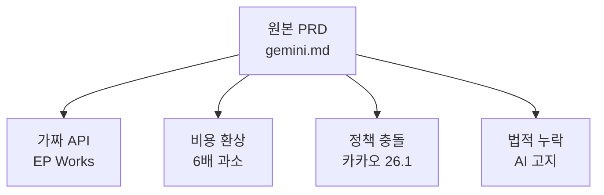

| 결함 | 실태 | 영향 |
|------|------|------|
| 가짜 API 명시 | EP Works 검색 불가 | 영업 협상 0건 |
| Vapi 분당 0.05달러 | 실제 0.30달러 (LLM·TTS·STT·통신비 별매) | 매장당 월 36만원 비용 |
| 카카오 알림톡 마케팅 발송 | 2026.1.1 정책 강화로 차단 | Before/After 영상 발송 불가 |
| 법적 고지 누락 | AI 통화·녹음·개인정보 | 행정처분 리스크 |

### 2.3 본 PRD의 설계 원칙

<!-- FB §2.3 · Design Principles -->
<table role="presentation">
<tr>
<td width="33%" valign="top">

**원칙 1 · 검증된 부품**

외부 부품(API)은 **공식 docs + 가격표 + 한국어 지원 + 법적 적합성** 4축으로 검증된 것만 채택. EP Works 같은 환상 회사명 0개.

</td>
<td width="33%" valign="top">

**원칙 2 · 핵심 내재화**

칸반·견적·재고·갤러리는 자체 개발. 외부에 맡기면 vendor lock-in + 가격 인상 위험. 매시업은 LLM·STT·결제·SMS 같은 **상품화된 인프라**로 한정.

</td>
<td width="33%" valign="top">

**원칙 3 · ROI 순서**

가장 싸고 즉각 효과 큰 기능 먼저(M1: 칸반+알림톡). 가장 비싸고 법적 리스크 큰 기능 마지막(M5: AI 통화). 원본 PRD의 정반대 우선순위.

</td>
</tr>
</table>

---

<a id="ch-3"></a>

## 3. 사용자 페르소나 5종

원본 PRD는 오너·엔지니어 2종만 정의했으나, 실제 매장 매출의 30~40%를 좌우하는 **보험사 어드저스터**와 사용자 만족도의 핵심인 **고객(차주)** 이 누락되어 있었습니다.

### 3.1 페르소나 표

| # | 페르소나 | 핵심 Pain | 본 SaaS의 가치 |
|:-:|---------|-----------|----------------|
| P1 | 오너 (대표) | 작업 중 전화 받음, 야간 장부 정리 | 칸반 + 자동 알림톡 + AI 통화 |
| P2 | 엔지니어 (직원) | 구두 지시 혼선, 디지털 거부감 | NFC 스티커 단계 이동, 음성 명령 |
| P3 | 고객 (차주) | 수리 진행 상태 모름, 보험 증빙 필요 | 정보성 알림톡 + Before/After PDF |
| P4 | 보험사 어드저스터 | 표준 견적서·증빙 사진 부재 | 표준 양식 PDF 자동 생성 |
| P5 | MRO 도매상 | 영세 매장 신용 불안 | 본 SaaS가 빌링 보증·중개 수수료 |

### 3.2 P1 오너 — 상세

<!-- FB §3.2 · Owner Persona -->
<table role="presentation" width="100%">
<tr>
<td width="50%" valign="top">

**§3.2 · 오너 (대표 1인)**

#### 디지털 리터러시

- 5060 세대 다수, 카카오톡·유튜브는 능숙
- 엑셀·견적서 양식은 어색
- 스마트폰 비중 안드로이드 70%

#### 하루 일과

- 09:00 입고 차량 확인 + 견적
- 11:00 도장 부스 작업
- 14:00 자재 발주 (전화 + 종이 메모)
- 17:00 출고 검수
- 20:00 야간 장부 정리 + 영수증
- 23:00 SNS 한 번 둘러봄

</td>
<td width="50%" valign="top">

**§3.2 · 측정 가능한 Pain**

| 3건 | 12만원 | 90분 |
|:---:|:---:|:---:|
| **하루 놓친 전화** | **하루 놓친 매출** | **야간 장부 정리** |

> *FIG · 1인 병목의 정량 지표*

#### 본 SaaS가 해결하는 것

1. **놓친 전화 0건** (Phase 3 AI 콜 + Phase 1 가예약 메모)
2. **야간 정리 0분** (Phase 1 칸반에서 완료 시 자동 매출 등록)
3. **재고 발주 1탭** (Phase 2 가격비교 + 후불 신용)

</td>
</tr>
</table>

### 3.3 P2 엔지니어 — Flip 변형

<!-- FB §3.3 (FLIP) · Engineer Persona -->
<table role="presentation" width="100%">
<tr>
<td width="50%" valign="top">

**§3.3 · 디지털 거부감 데이터**

| 80% | 60% | 30% |
|:---:|:---:|:---:|
| **장갑 낀 채 작업** | **태블릿 입력 거부** | **외국인 노동자 비율** |

> *FIG · 엔지니어 UI 설계의 제약*

#### 본 SaaS의 대응

1. **NFC/QR 스티커**: 작업대마다 부착 → 태깅으로 단계 이동
2. **음성 명령** (Phase 3): "도장 끝" 한마디 → 단계 이동
3. **다국어 UI** (Phase 2): 한국어 + 베트남어 + 중국어

</td>
<td width="50%" valign="top">

**§3.3 · 엔지니어 (직원 1~2인)**

#### Pain

- 구두 지시 흘려들음 → 작업 누락
- 사진·메모 의무 거부감
- 본인 평가가 시스템에 기록되는 것 싫어함
- 외국인의 경우 한국어 UI 한계

#### 동기 부여 전략

- 단계 이동만으로 완료 인정 (사진·메모는 옵션)
- 단순 NFC 태깅 → 30초 안에 끝남
- 매장 인센티브와 연동 (매장 단위, 개인 단위 X)

</td>
</tr>
</table>

### 3.4 P4 보험사 어드저스터 — 누락된 핵심 페르소나

원본 PRD에는 없었으나, 실제 휠/판금 매장 매출의 30~40%는 보험 수리에서 발생합니다. 어드저스터가 사용하는 표준 양식과 사진 증빙 요구를 자동 충족하면 매장의 보험사 채택률이 높아집니다.

| 요구 | 본 SaaS의 자동 충족 |
|------|---------------------|
| 표준 견적서 PDF | LaborStandard 기반 자동 생성 |
| Before/After 사진 (4방향) | 입고 시 카메라 가이드 강제 촬영 |
| 작업 시간 기록 | 칸반 단계 이동 타임스탬프 |
| 부품 사용 내역 | StockTransaction 자동 기록 |
| 세금계산서 | PopBill API 자동 발행 |

---

<a id="ch-4"></a>

## 4. 비즈니스 모델

원본은 매장당 정액제 SaaS 단일 수익원이었으나, 본 PRD는 6개 수익원을 단계별로 활성화합니다.

### 4.1 수익원 6종

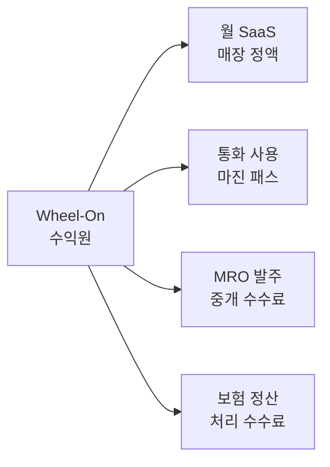

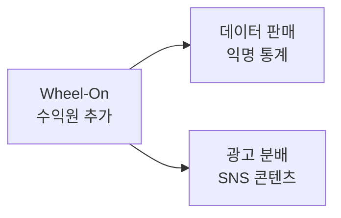

### 4.2 단계별 활성화

| 수익원 | 활성화 시점 | 매장당 월 기여 (목표) |
|--------|:----------:|:---------------------:|
| R1. 월 SaaS 정액 | M1 (즉시) | 99,000원 |
| R2. 통화 사용 마진 | M5 | 8,000원 |
| R3. MRO 중개 수수료 | M4 | 15,000원 |
| R4. 보험 정산 수수료 | M6 | 25,000원 |
| R5. 익명 통계 판매 | M12+ | 매장당 분배 5,000원 |
| R6. SNS 광고 분배 | M18+ | 매장당 분배 3,000원 |

### 4.3 가격 정책 핵심

<!-- FB §4.3 · Pricing -->
<table role="presentation" width="100%">
<tr>
<td width="50%" valign="top">

**§4.3 · 가격 모델**

#### 단일 SKU + 사용량 패스스루

- **기본 99,000원/월** (매장 단위, 사용자 무제한)
- **+ 통화 사용량**: 분당 350원 (마진 100원 포함)
- **+ 알림톡**: 발송당 15원 (실비 13원 + 마진 2원)
- **+ 영상 렌더**: 1편당 1,000원 (FFmpeg 자체 호스팅)

#### 프로모션

- 첫 3개월 무료 (락인 형성)
- 연간 일시불 -15%

</td>
<td width="50%" valign="top">

**§4.3 · 매장 ROI 시연**

| +12만원 | -10만원 | -3만원 |
|:---:|:---:|:---:|
| **놓친 매출 회수/일** | **자재비/월** | **세무 비용/월** |

> *FIG · SaaS 비용 9.9만원 대비 매장 순이익 +20만원 이상*

#### 락인 메커니즘

- 매장의 **수리 카드 데이터 + 표준 공임**이 매월 학습됨
- 이탈 시 데이터 export 가능하나 학습된 가격 추천은 사라짐
- 데이터가 자산이 되는 SaaS 구조

</td>
</tr>
</table>

---

<a id="ch-5"></a>

## 5. 시스템 아키텍처

### 5.1 Overview — 4-Layer 구조

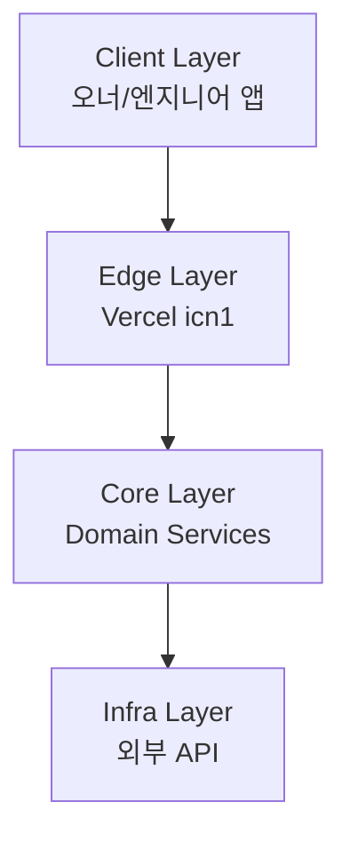

각 Layer는 Detail 다이어그램으로 분해됩니다.

### 5.2 Detail — Client Layer

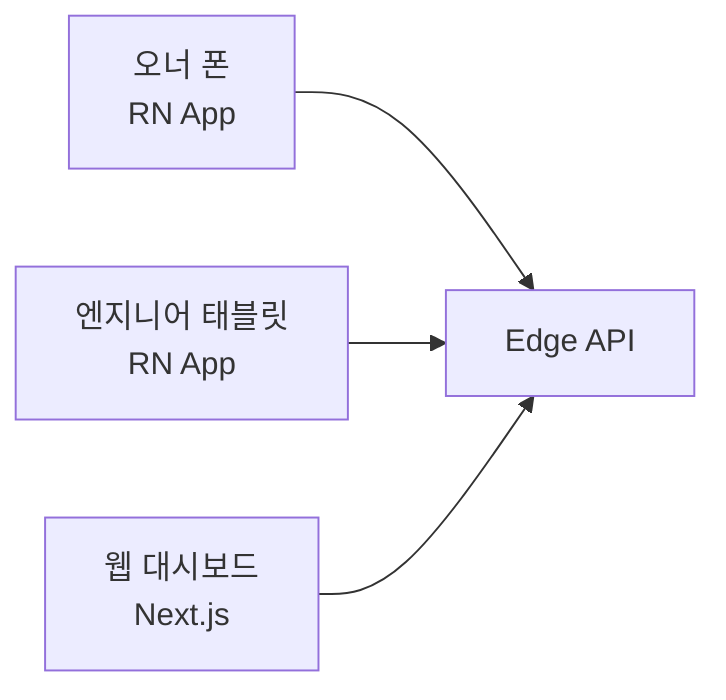

### 5.3 Detail — Core Layer (Domain Services)

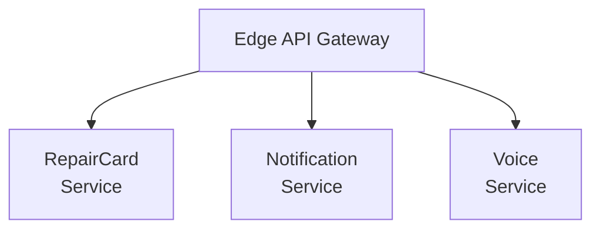

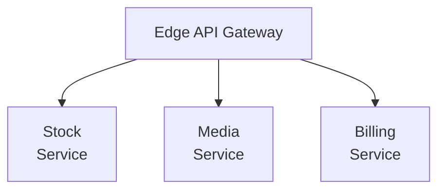

### 5.4 Detail — Infra Layer (외부 의존성)

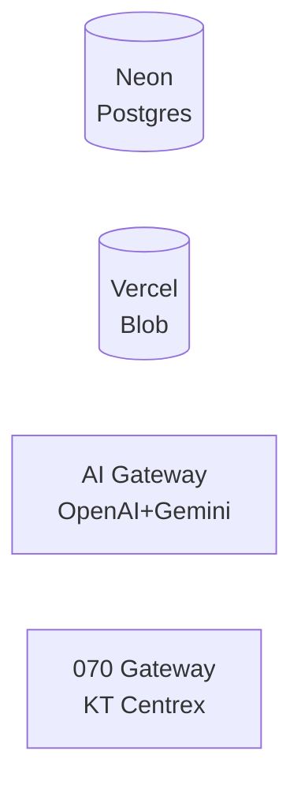

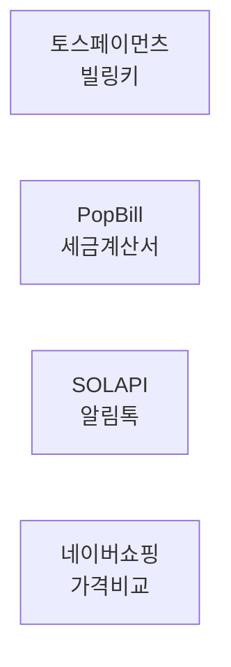

### 5.5 데이터 흐름 — 통화 응대 시나리오

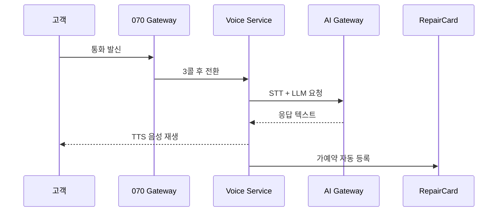

### 5.6 배포 토폴로지

| 컴포넌트 | 호스트 | 리전 | 이유 |
|---------|--------|:----:|------|
| Edge API | Vercel Functions | icn1 | 한국 사용자 latency |
| 웹 대시보드 | Vercel | icn1 | 동일 |
| 모바일 앱 | App Store / Play | global | 매장 디바이스 |
| Postgres | Neon Marketplace | icn1 | 한국 데이터 주권 |
| Blob (사진/영상) | Vercel Blob | icn1 | 동일 |
| AI Gateway | Vercel AI Gateway | global | 모델 폴백 |
| 070 Gateway | KT Centrex | 국내 | 통신사 인프라 |

### 5.7 핵심 결정의 이유

| 결정 | 채택 | 이유 |
|------|:----:|------|
| 한국 리전 (icn1) | ✅ | 개인정보보호법 + 통신 latency |
| Fluid Compute | ✅ | 통화 burst 처리, cold start 최소 |
| AI Gateway 경유 | ✅ | OpenAI ↔ Gemini 폴백 + 비용 추적 |
| Vapi 미채택 | ❌ | OpenAI Realtime 직결이 분당 50원 더 쌈 |
| Make.com 미채택 | ❌ | 운영 단위 과금 폭탄, 자체 Job Queue 사용 |
| Neon Postgres | ✅ | branching으로 매장별 격리 + RLS |

---

<a id="ch-6"></a>

## 6. 핵심 도메인 모델

### 6.1 엔티티 관계 — Overview

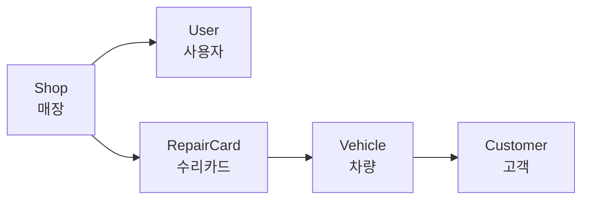

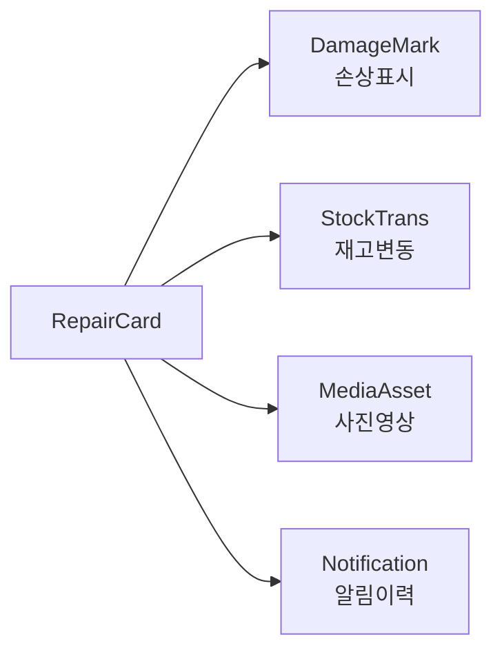

### 6.2 엔티티 명세표

| 엔티티 | 핵심 필드 | 관계 |
|--------|----------|------|
| Shop | id, name, businessNumber, plan | 1:N User, RepairCard |
| User | id, shopId, role, phone | role: OWNER/ENGINEER |
| Customer | id, name, phone, kakaoOptin | 1:N Vehicle |
| Vehicle | id, plateNumber, model, year | 1:N RepairCard |
| RepairCard | id, status, estimatedAmount, finalAmount | 핵심 도메인 |
| DamageMark | id, repairCardId, photoUrl, aiLabel, severity | AI 라벨 결과 |
| LaborStandard | id, type, basePrice, baseTimeHours | 표준 공임 DB |
| StockItem | id, name, sku, currentQty, safetyLevel | 매장별 재고 |
| StockTransaction | id, stockItemId, repairCardId, delta, type | 재고 변동 |
| PriceQuote | id, stockItemId, vendor, price, fetchedAt | 외부 가격 캐시 |
| MediaAsset | id, repairCardId, stage, blobUrl | BEFORE/DURING/AFTER |
| Call | id, customerPhone, transcript, summary | 통화 기록 |
| Reservation | id, customerPhone, desiredDate, confirmed | 가예약 |
| Notification | id, channel, templateCode, status | 발송 이력 |
| ShortVideo | id, repairCardId, renderedUrl, publishedTo | 쇼츠 산출물 |

### 6.3 RepairCard 상태 머신

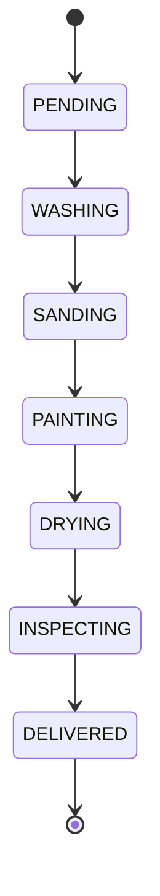

각 전이마다 자동 알림톡 발송 + 타임스탬프 기록.

### 6.4 RLS (Row Level Security) 정책

| 테이블 | 정책 |
|--------|------|
| Shop | 본인 소속만 SELECT |
| User | 본인 + 동일 Shop 멤버 SELECT |
| RepairCard | 동일 shopId만 SELECT/UPDATE |
| MediaAsset | 동일 shopId + Customer 본인 (제한) |
| 모든 PII 컬럼 | AES-256 암호화 저장 |

### 6.5 데이터 보존·파기 정책

| 데이터 | 보존 기간 | 파기 방법 |
|--------|:--------:|-----------|
| 수리 카드 | 5년 (세법) | 자동 익명화 |
| 통화 녹음 | 3개월 | 자동 삭제 |
| 통화 텍스트 | 1년 | 자동 익명화 |
| 영상 (Before/After) | 매장 보유 기간 | 매장 요청 시 삭제 |
| 결제 정보 | 5년 (전자금융거래법) | 토스가 보관, 본 SaaS는 토큰만 |

---

<a id="ch-7"></a>

## 7. 핵심 기능 명세

### 7.1 디지털 작업 카드 + 칸반 보드 (M1)

<!-- FB §7.1 · Workflow Core -->
<table role="presentation" width="100%">
<tr>
<td width="50%" valign="top">

**§7.1 · 핵심 동작**

#### 입고 시

1. 카메라 가이드: 4방향 (정면·후면·좌·우) 강제 촬영
2. AI 사진 분석 → 손상 부위 자동 라벨 (Phase 2부터)
3. 차량 번호 OCR → Vehicle 자동 생성
4. 표준 공임 매칭 → 견적 자동 산출
5. 고객 카카오톡으로 견적 PDF 발송

#### 작업 진행

1. 수리 카드 생성 → PENDING
2. NFC/QR 스티커 태깅 → 다음 단계 이동
3. 단계별 자동 알림톡 발송 (정보성)
4. 사진/메모는 옵션 (강제 X)

#### 완료 시

1. INSPECTING → DELIVERED 전이 시 매출 자동 등록
2. Before/After 갤러리 자동 생성
3. 영수증 + 세금계산서 자동 발행

</td>
<td width="50%" valign="top">

**§7.1 · 화면 ASCII (오너 앱)**

```
+----------------------------+
| Wheel-On    [🔔 3] [👤]    |
+----------------------------+
| 📊 오늘 매출: 450,000원    |
| 📞 가예약: 3건             |
+----------------------------+
| [+ 새 수리 카드]           |
+----------------------------+
| 칸반 (스와이프)            |
| ┌──┬──┬──┬──┬──┬──┬──┐    |
| │대│세│샌│도│건│검│출│    |
| │기│척│딩│장│조│수│고│    |
| │ 2│ 1│ 1│ 3│ 0│ 1│ 2│    |
| └──┴──┴──┴──┴──┴──┴──┘    |
+----------------------------+
| 14:00 김OO 카니발 입고     |
| 16:30 박OO 그랜저 출고     |
+----------------------------+
```

</td>
</tr>
</table>

#### 7.1.1 수락 기준 (Acceptance Criteria)

| AC | 검증 방법 |
|----|----------|
| 입고~견적까지 90초 이내 | 측정 로그 |
| NFC 태깅 후 단계 이동 1초 이내 | UI 측정 |
| 4방향 사진 누락 시 견적 발송 차단 | 통합 테스트 |
| 단계 이동 시 알림톡 5초 이내 발송 | E2E 테스트 |

### 7.2 카카오 알림톡 — 정보성 한정 (M1)

<!-- FB §7.2 (FLIP) · Notification -->
<table role="presentation" width="100%">
<tr>
<td width="50%" valign="top">

**§7.2 · 발송 가능 템플릿**

| 코드 | 시점 | 정보 유형 |
|------|------|----------|
| ARRIVAL | 입고 확정 | 정보성 |
| ESTIMATE | 견적 발송 | 정보성 |
| START | 작업 시작 | 정보성 |
| STAGE | 단계 이동 | 정보성 |
| READY | 출고 준비 | 정보성 |
| RECEIPT | 영수증 발행 | 정보성 |

#### 차단되는 것 (2026.1.1 정책)

- ❌ 마케팅성 영상 (Before/After)
- ❌ 쿠폰/할인 (사전 동의 없으면)
- ❌ 신규 차종 홍보

#### 백업 채널

알림톡 차단/실패 시 LMS 자동 발송 (단가 약 30원).

</td>
<td width="50%" valign="top">

**§7.2 · 알림톡 템플릿 예시**

```
[Wheel-On 이OO 휠복원]

안녕하세요, 김OO 고객님.

차량 12가 3456 그랜저의
복원 작업이 [도장] 단계로
진행되었습니다.

예상 출고: 5/7 (목) 16:00

진행 상황 확인:
https://wheel-on.kr/r/abc123

본 메시지는 작업 진행 안내를
위해 발송되었습니다.
```

> *FIG · 카카오 정보성 정책 적합*

</td>
</tr>
</table>

### 7.3 Before/After 사진 갤러리 (M1)

<!-- FB §7.3 · Gallery -->
<table role="presentation" width="100%">
<tr>
<td width="50%" valign="top">

**§7.3 · 자동 생성**

#### 입고 시 (BEFORE)

- 4방향 강제 촬영
- AI가 손상 부위 박스 표시 (Phase 2)
- 메타데이터: 시각, GPS, 차량번호

#### 출고 시 (AFTER)

- 동일 4방향 카메라 가이드
- AI가 BEFORE 사진과 자동 매칭
- 슬라이더 비교 뷰어 자동 생성

#### 활용

1. 고객에게 카카오 알림톡 링크
2. 보험사 제출용 PDF 자동 생성
3. SNS 쇼츠 자동 편집 소스 (Phase 3)

</td>
<td width="50%" valign="top">

**§7.3 · PDF 양식 (보험사용)**

```
+----------------------------+
| 외관 수리 결과 보고서      |
| 차량: 12가 3456 (그랜저)   |
| 매장: OO휠복원 (사업자번호) |
| 작업 기간: 5/3 ~ 5/7       |
+----------------------------+
| [BEFORE]      [AFTER]      |
| 정면 □         정면 □       |
| 후면 □         후면 □       |
| 좌측 □         좌측 □       |
| 우측 □         우측 □       |
+----------------------------+
| 손상 명세                  |
| - 좌측 펜더 스크래치 (3급) |
| - 휠 다이아 컷팅 (4급)     |
+----------------------------+
| 표준 공임   180,000원     |
| 부품비       45,000원     |
| 합계        225,000원     |
+----------------------------+
```

</td>
</tr>
</table>

### 7.4 AI 손상 라벨링 + 표준 공임 추천 (M3)

<!-- FB §7.4 · AI Estimate -->
<table role="presentation" width="100%">
<tr>
<td width="50%" valign="top">

**§7.4 · 처리 파이프라인**

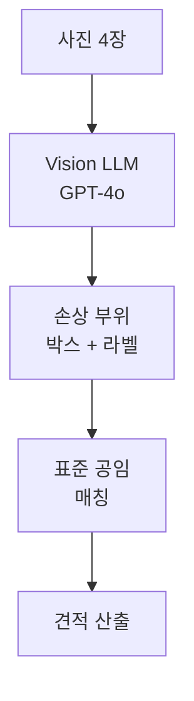

#### 라벨 종류 (10종)

- SCRATCH (스크래치)
- DENT (찌그러짐)
- PAINT_PEEL (도장 박리)
- WHEEL_CURB (휠 연석 손상)
- WHEEL_DIAMOND_CUT (다이아 컷팅)
- BUMPER_CRACK (범퍼 크랙)
- HEADLIGHT_FOG (헤드램프 황변)
- GLASS_CHIP (유리 칩)
- TIRE_DAMAGE (타이어 손상)
- OTHER (기타)

#### 심각도

1~5단계 (1=경미, 5=교체 필요)

</td>
<td width="50%" valign="top">

**§7.4 · 표준 공임 학습**

| 1,000건 | 0.5만원 | 90% |
|:---:|:---:|:---:|
| **데이터 임계점** | **공임 오차 범위** | **추천 채택률 목표** |

> *FIG · 매장 데이터가 곧 자산*

#### 학습 메커니즘

1. 매장이 실제 공임을 입력하면 LaborStandard 누적
2. 차종 × 손상 종류 × 심각도 매트릭스로 평균
3. 신규 매장은 첫날부터 평균값 추천 받음
4. 자기 매장 데이터 100건 누적 후 매장 맞춤 가격으로 전환

#### 차별화 포인트

- 신규 매장: 시장 평균 가격으로 시작
- 1년차 매장: 매장 맞춤 가격으로 진화
- 데이터 이전 시 매장 가격 사라짐 → 락인

</td>
</tr>
</table>

### 7.5 자재 재고 + 가격비교 (M3)

원본 PRD는 "MRO 도매 API 자동 발주"였으나, 한국에는 그런 표준 도매 API가 없습니다. 본 PRD는 **가격비교 검색 + 1탭 발주 추천**으로 재정의합니다.

<!-- FB §7.5 (FLIP) · Stock -->
<table role="presentation" width="100%">
<tr>
<td width="50%" valign="top">

**§7.5 · 가격비교 데이터 소스**

| 소스 | 용도 | 한도 |
|------|------|------|
| 네이버 쇼핑 API | 일반 자재 | 일 25,000건 |
| 11번가 OpenAPI | 가격 비교 | 일 10,000건 |
| 쿠팡 파트너스 | 정품 부품 | 제휴 필요 |
| 매장 직접 입력 | 단골 도매상 | 무제한 |

#### 발주 흐름

1. 도장 단계 완료 → 도료 ml 자동 차감
2. 안전 재고 미만 → 알림 + 가격비교
3. 매장이 1탭 클릭 → 카트 담김
4. 일괄 발주 (오너 승인)
5. 토스페이먼츠 빌링키로 결제

</td>
<td width="50%" valign="top">

**§7.5 · 자재 재고 화면**

```
+----------------------------+
| 자재 재고                  |
+----------------------------+
| ⚠️ 재고 부족 2종           |
+----------------------------+
| 🎨 베이스 도료 (검정)      |
|   현재: 200ml / 안전: 500ml|
|   [💰 8,500원 → 7,200원]  |
|   [📦 3곳 비교]            |
+----------------------------+
| 📜 마스킹 테이프 18mm      |
|   현재: 1롤 / 안전: 5롤    |
|   [💰 1,200원]             |
+----------------------------+
| [장바구니에 담기 (2)]      |
| [일괄 발주]                |
+----------------------------+
```

</td>
</tr>
</table>

#### 7.5.1 자동 발주 안 함 (의도적 결정)

| 가능 시나리오 | 본 PRD 채택 |
|--------------|:----------:|
| 안전 재고 미만 시 자동 발주 | ❌ |
| 매장에 추천만 + 1탭 발주 | ✅ |

> 한국 도매상 가격은 시간 단위로 변동하며, 신용 거래 관계가 매장별로 다릅니다. 자동 발주는 매장 신뢰를 깨는 가장 빠른 방법입니다.

### 7.6 음성 AI 통화 자동 응대 (M5)

원본 PRD는 Vapi를 사용했으나, 한국어 native 미지원 + 분당 비용 6배 폭탄 + 법적 고지 누락의 3중 결함이 있습니다. 본 PRD는 **OpenAI Realtime API + KT Centrex + AI 고지 멘트 의무**로 재구성합니다.

<!-- FB §7.6 · Voice AI -->
<table role="presentation" width="100%">
<tr>
<td width="50%" valign="top">

**§7.6 · 통화 흐름**

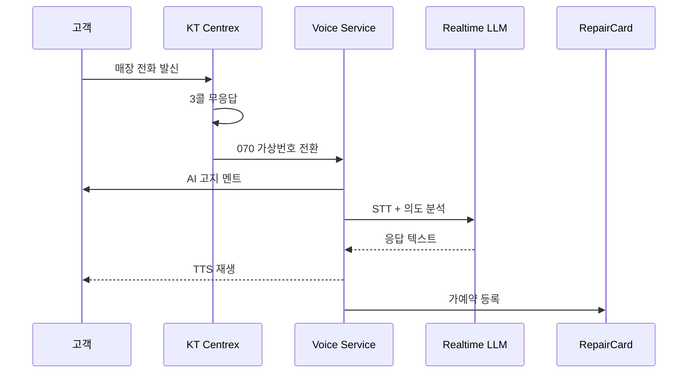

#### 첫 멘트 (법적 고지)

> "안녕하세요, OO 휠복원입니다. 사장님이 작업 중이라 AI 비서가 안내드립니다. 통화 내용은 녹음·텍스트화됩니다. 거부하시려면 # 키를 눌러 사장님께 직접 연결해드립니다."

</td>
<td width="50%" valign="top">

**§7.6 · 비용 구조 (검증)**

| 350원 | 17원 | 50원 |
|:---:|:---:|:---:|
| **분당 총원가** | **VITO STT 백업** | **070 통신비** |

> *FIG · Vapi 대비 분당 50원 절감*

#### 모델 선택

- 1순위: OpenAI gpt-realtime (GA, 한국어 지원)
- 2순위: Gemini 3.1 Flash Live (90+ 언어)
- 폴백: VITO STT + GPT-4o-mini (텍스트 모드)

#### 의도 추출 슬롯

- vehicleModel (차종)
- damageDescription (손상 설명)
- desiredDate (희망 날짜)
- contactNumber (연락처)
- urgencyLevel (긴급도)

</td>
</tr>
</table>

#### 7.6.1 법적 의무 (전기통신사업법 + 통신비밀보호법)

| 의무 | 본 PRD 처리 |
|------|------------|
| AI 통화 임을 사전 고지 | 첫 멘트에 명시 |
| 통화 녹음 사전 동의 | # 키로 거부 가능 |
| 녹음 보존 기간 명시 | 3개월 후 자동 삭제 |
| 텍스트 데이터 익명화 | 1년 후 자동 처리 |
| 사업자 정보 표시 | KT Centrex 발신정보 |

### 7.7 쇼츠 자동 편집 (M5) — 알파컷·OpusClip 의존 제거

원본 PRD는 알파컷·OpusClip API를 사용했으나, ① 알파컷은 공개 API 없음 ② OpusClip은 영어 자막 중심 + 엔터프라이즈 협상 필요. 본 PRD는 **FFmpeg + GPT-4o 자막**을 자체 호스팅합니다.

<!-- FB §7.7 (FLIP) · Shorts -->
<table role="presentation" width="100%">
<tr>
<td width="50%" valign="top">

**§7.7 · 처리 파이프라인**

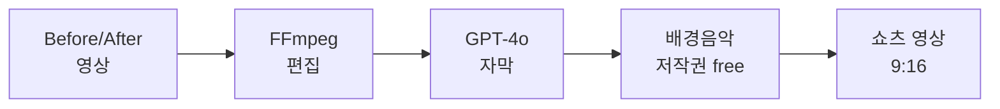

#### 자체 호스팅의 이점

1. **영상 1편당 1,000원** (외부 API의 1/3)
2. 매장 데이터 외부 유출 없음
3. 자막 폰트·색상 매장 브랜딩 가능
4. 한국어 자막 정확도 99%+ (GPT-4o)

#### 처리 시간

| 입력 영상 | 처리 시간 | 비용 |
|:--------:|:--------:|:----:|
| 1분 | 30초 | 800원 |
| 3분 | 90초 | 1,200원 |
| 10분 | 300초 | 2,500원 |

</td>
<td width="50%" valign="top">

**§7.7 · 자동 자막 예시**

```
0:00 ━━━━━━━━━━━━━━━━━ 0:30
[BEFORE 사진]
"포르쉐 타이칸 휠 복원 시작"

0:05
[샌딩 영상]
"다이아 컷팅 손상 4급"

0:15
[도장 영상]
"순정 색상 매칭"

0:25
[AFTER 사진]
"새 휠처럼 복원 완료"

0:30
"OO휠복원 | 010-XXXX-XXXX"
```

#### 원클릭 배포

- 유튜브 쇼츠 (Data API)
- 인스타 릴스 (Graph API)
- 네이버 블로그 (오픈 API)

</td>
</tr>
</table>

### 7.8 결제·빌링·세금계산서 (M1)

<!-- FB §7.8 · Billing -->
<table role="presentation" width="100%">
<tr>
<td width="50%" valign="top">

**§7.8 · 빌링 흐름**

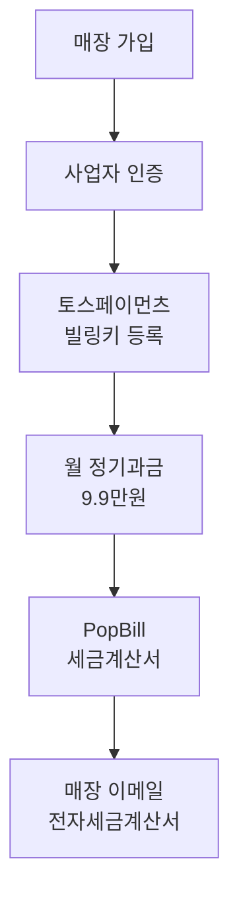

#### 부가 청구

| 항목 | 단가 | 정산 |
|------|------|------|
| 통화 사용량 | 분당 350원 | 월말 합산 |
| 알림톡 발송 | 건당 15원 | 월말 합산 |
| 영상 렌더 | 편당 1,000원 | 즉시 |
| MRO 발주 | 결제액의 1.5% | 월말 합산 |

</td>
<td width="50%" valign="top">

**§7.8 · 세금계산서 자동화**

#### PopBill 연동 흐름

1. 매월 1일 매장 사용량 집계
2. 매장 사업자번호로 전자세금계산서 발행 요청
3. 국세청 NTS 자동 신고
4. 매장 이메일 + SMS 통지

#### 미수 관리

- D+5: 1차 알림톡
- D+10: SMS + 이메일
- D+15: 서비스 일시 중단 (데이터는 보존)
- D+30: 계약 종료 + 데이터 export 안내

#### 환불 규정

월 정액은 사용일 기준 일할 환불.
사용량 패스스루는 환불 불가.

</td>
</tr>
</table>

### 7.9 음성 명령 단계 이동 (M5, 엔지니어용)

엔지니어가 장갑 낀 손으로 NFC도 못 태깅할 때를 위한 보조 입력. wake word "헤이 휠온" 후 명령 인식.

| 명령 | 동작 |
|------|------|
| "도장 끝" | PAINTING → DRYING 전이 |
| "검수 통과" | INSPECTING → DELIVERED |
| "사진 한 장" | 카메라 자동 촬영 |
| "메모해" | 음성 메모 → STT → 카드에 저장 |
| "사장님 호출" | 오너 폰 푸시 알림 |

엔진: OpenAI Realtime + on-device wake word (Picovoice Porcupine).

---

<a id="ch-8"></a>

## 8. 비기능 요구사항

### 8.1 성능

| 지표 | 목표 | 측정 방법 |
|------|:----:|----------|
| 입고~견적 발송 | 90초 이내 | E2E 로그 |
| 칸반 단계 이동 | 1초 이내 | UI 측정 |
| 알림톡 발송 | 5초 이내 | SOLAPI 콜백 |
| AI 통화 응답 지연 | 1.5초 이내 | Realtime API 측정 |
| 사진 업로드 (4장) | 10초 이내 | Vercel Blob |
| 쇼츠 렌더 (3분 영상) | 90초 이내 | FFmpeg job |
| 가격비교 응답 | 3초 이내 | 캐시 + 폴백 |

### 8.2 보안

| 영역 | 정책 |
|------|------|
| 통신 | TLS 1.3 강제 |
| 인증 | OAuth 2.0 + 매직 링크 (사장님 5060 친화) |
| 권한 | RBAC (OWNER/ENGINEER/OBSERVER) |
| PII 저장 | AES-256 at rest |
| PII 로그 | 마스킹 (전화·차량번호) |
| 감사 로그 | 모든 RepairCard 변경 이력 |
| 시크릿 관리 | Vercel env vars + 회전 90일 |

### 8.3 가용성

| SLA | 목표 |
|-----|:----:|
| API 가용성 | 99.9% (월 43분 다운 허용) |
| 알림톡 발송 성공률 | 95%+ (SOLAPI 의존) |
| AI 통화 응답률 | 90%+ (LLM 폴백) |
| 데이터 백업 | 일 1회 + 시간당 증분 |
| 복구 시간 (RTO) | 1시간 |
| 복구 지점 (RPO) | 1시간 |

### 8.4 접근성·사용성

| 항목 | 정책 |
|------|------|
| 다크 모드 | 기본 (도장 부스 환경) |
| 폰트 크기 | 최소 16pt, 본문 18pt |
| 버튼 최소 크기 | 60×60dp (장갑 대응) |
| 색맹 대응 | 신호색 + 아이콘 병기 |
| 다국어 | 한국어 + 베트남어 + 중국어 (Phase 2) |
| 오프라인 모드 | 칸반·메모 캐시 + 동기화 (Phase 2) |

### 8.5 호환성

| 플랫폼 | 최소 버전 |
|--------|:--------:|
| iOS | 14.0+ |
| Android | 8.0+ (API 26) |
| 웹 대시보드 | Chrome/Edge 최신 2버전 |
| 태블릿 | iPad mini 5+ / Galaxy Tab A 8+ |

---

<a id="ch-9"></a>

## 9. 법적·컴플라이언스 체크리스트

원본 PRD가 완전히 누락한 영역. 출시 전 모두 통과해야 합니다.

### 9.1 출시 전 필수 (M1 종료 시점)

| 항목 | 처리 |
|------|------|
| 통신판매업 신고 (관할 지자체) | 사업자등록 후 즉시 |
| 카카오 알림톡 채널 인증 | 사업자등록증 + 통신판매업 |
| 토스페이먼츠 PG 계약 | 빌링키 + 본인인증 |
| PopBill 전자세금계산서 계약 | 사업자등록증 |
| 개인정보처리방침 게시 | 웹 + 앱 |
| 약관 (이용·환불·분쟁조정) | 한국소비자원 표준양식 |
| ISMS-P 자율 인증 (1년차 목표) | M12 이후 |

### 9.2 AI 통화 의무 (M5 출시 시)

| 의무 | 근거 법령 |
|------|----------|
| AI 응답 임을 사전 고지 | 전기통신사업법 시행령 §42-3 |
| 통화 녹음 시 사전 동의 | 통신비밀보호법 §3 |
| 본인 부재 시 인간 응대 우회 옵션 | 통신민원 표준 |
| 녹음 보존 3개월 + 자동 파기 | 개인정보보호법 §21 |

### 9.3 개인정보 처리

| 정보 | 수집 근거 | 보존 기간 |
|------|----------|:--------:|
| 매장 사업자 정보 | 계약 이행 | 5년 (세법) |
| 오너·엔지니어 연락처 | 계약 이행 | 탈퇴 시 즉시 파기 |
| 고객 차량번호 | 매장 동의 + 매장 책임 | 매장 보유 기간 |
| 고객 연락처 | 매장 동의 + 매장 책임 | 매장 보유 기간 |
| 통화 녹음 | 통화 시작 시 동의 | 3개월 |
| 결제 정보 | 토스 보관, 본 SaaS는 토큰만 | 5년 (전자금융) |

### 9.4 분쟁 대응

| 상황 | 처리 절차 |
|------|----------|
| AI 통화 오인식으로 가예약 누락 | 매장 책임 면책 + 환불 |
| 알림톡 발송 실패로 고객 항의 | LMS 백업 + 발송 로그 증빙 |
| 견적 추천 오류로 매장 손실 | 추천은 보조, 최종 결정은 매장 책임 |
| 데이터 유출 사고 | 72시간 내 KISA 신고 |

---

<a id="ch-10"></a>

## 10. UI/UX 디자인 원칙

### 10.1 Field-First (현장 우선)

<!-- FB §10.1 · Field First -->
<table role="presentation" width="100%">
<tr>
<td width="50%" valign="top">

**§10.1 · 5대 원칙**

1. **큰 버튼**: 최소 60×60dp, 장갑 낀 손가락 기준
2. **다크 모드 기본**: 도장 부스 어두움 + 야외 햇빛 시인성
3. **고대비**: 명도 차이 7:1 이상
4. **스와이프 우선**: 칸반은 좌우 스와이프 / 단계 이동은 NFC
5. **음성 보조**: 손이 자유롭지 않을 때 (Phase 3)

</td>
<td width="50%" valign="top">

**§10.1 · Anti-Patterns (금지)**

- ❌ 햄버거 메뉴 (5060 세대 인식 어려움)
- ❌ 작은 토스트 알림 (작업 중 못 봄)
- ❌ 멀티 스텝 모달 (한 화면에 1개 작업)
- ❌ 자동 로그아웃 (작업 중 끊김)
- ❌ 길게 누르기 단축어 (장갑 인식 불가)

</td>
</tr>
</table>

### 10.2 Low-Cognitive Load

| 원칙 | 적용 |
|------|------|
| 한 화면 = 한 작업 | 입고/견적/단계 이동 분리 |
| 결정 지점 최소화 | 가격은 추천값 + 1탭 확정 |
| 온보딩 자동화 | API 키 입력 등은 가입 시 자동 |
| 디폴트 값 풍부 | 표준 공임은 시장 평균 자동 |

### 10.3 정보 위계

```
+----------------------------+
| L1: 오늘의 핵심 (대문)     |  ← 매출, 가예약, 재고 부족
+----------------------------+
| L2: 진행 중 작업 (칸반)    |  ← 단계별 카드 수
+----------------------------+
| L3: 오늘 약속 (캘린더)     |  ← 입출고 시간
+----------------------------+
| L4: 과거 기록 (옵션)       |  ← 검색해서 접근
+----------------------------+
```

---

<a id="ch-11"></a>

## 11. 기술 스택

<!-- FB §11 · Tech Stack -->
<table role="presentation">
<tr>
<td width="33%" valign="top">

**Frontend**

- **React Native 0.74+** (New Architecture)
- **Expo SDK 51** (OTA 업데이트)
- **TanStack Query** (서버 상태)
- **Zustand** (클라이언트 상태)
- **NativeWind** (Tailwind 호환)
- **Reanimated 3** (애니메이션)

웹 대시보드:
- **Next.js 16** (App Router)
- **shadcn/ui** (디자인 시스템)

</td>
<td width="33%" valign="top">

**Backend**

- **Vercel Functions** (Node.js 24 LTS)
- **Fluid Compute** (cold start 최소)
- **Hono** (Edge runtime 호환)
- **Vercel AI Gateway** (LLM 라우팅)
- **Drizzle ORM** (Postgres)
- **BullMQ** (Job Queue, 쇼츠 렌더)

데이터:
- **Neon Postgres** (icn1, RLS)
- **Vercel Blob** (사진/영상)
- **Upstash Redis** (캐시)

</td>
<td width="33%" valign="top">

**External APIs**

- **OpenAI Realtime** (음성)
- **Gemini 3.1 Flash Live** (폴백)
- **VITO STT** (한국어 백업)
- **SOLAPI** (카카오 알림톡)
- **토스페이먼츠** (빌링키)
- **PopBill** (세금계산서)
- **KT Centrex** (070 가상번호)
- **네이버 쇼핑 API** (가격비교)

DevOps:
- **GitHub Actions** (CI)
- **Vercel** (CD + Preview)
- **Sentry** (에러 추적)

</td>
</tr>
</table>

### 11.1 모노레포 구조

```
hub_motors/
├── apps/
│   ├── mobile/          # React Native (Expo)
│   ├── web/             # Next.js 16 대시보드
│   └── api/             # Vercel Functions
├── packages/
│   ├── core/            # 도메인 모델 + Drizzle
│   ├── ai/              # AI Gateway 래퍼
│   ├── ui/              # shadcn 공유 컴포넌트
│   └── config/          # ESLint·TS·Tailwind
├── docs/
│   ├── 00-prd/
│   ├── 01-plan/
│   └── 02-design/
└── turbo.json           # Turborepo
```

### 11.2 모델 라우팅 전략 (AI Gateway)

| 작업 | 1순위 | 2순위 폴백 |
|------|------|-----------|
| 손상 사진 라벨링 | gpt-4o (Vision) | gemini-2.5-flash |
| 견적 추천 | claude-haiku-4.5 | gpt-4o-mini |
| 통화 응대 | gpt-realtime | gemini-3.1-flash-live |
| 자막 생성 | gpt-4o-mini | claude-haiku-4.5 |
| STT 백업 | vito | whisper-large-v3 |

---

<a id="ch-12"></a>

## 12. 단계별 로드맵

### 12.1 Phase 1 — MVP (M1~M2)

**목표**: 매장 10곳 베타. 1인 병목의 70% 해소.

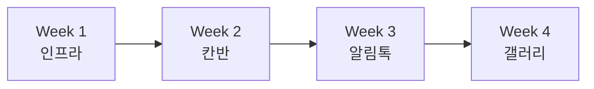

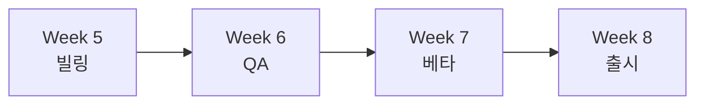

| Week | 산출물 |
|:----:|--------|
| 1 | Vercel + Neon + 토스페이먼츠 셋업, 인증 |
| 2 | RepairCard CRUD + 칸반 보드 |
| 3 | 카카오 알림톡 + SOLAPI 연동 |
| 4 | Before/After 갤러리 + Vercel Blob |
| 5 | 토스 빌링키 + PopBill 세금계산서 |
| 6 | E2E 테스트 + 보안 점검 |
| 7 | 매장 3곳 클로즈드 베타 |
| 8 | 매장 10곳 GA |

### 12.2 Phase 2 — 데이터 자산화 (M3~M4)

| Week | 산출물 |
|:----:|--------|
| 9~10 | AI 손상 라벨링 (GPT-4o Vision) |
| 11~12 | 표준 공임 학습 엔진 + 추천 |
| 13~14 | 자재 재고 + 가격비교 (네이버 쇼핑) |
| 15~16 | 다국어 UI (베트남어·중국어) |

### 12.3 Phase 3 — 차별화 무기 (M5~M6)

| Week | 산출물 |
|:----:|--------|
| 17~18 | KT Centrex + AI 통화 응대 (법적 고지 포함) |
| 19~20 | 통화 STT + 가예약 자동화 |
| 21~22 | FFmpeg 쇼츠 자동 편집 |
| 23~24 | SNS 원클릭 배포 + 광고 분배 |

---

<a id="ch-13"></a>

## 13. KPI 및 성공 지표

### 13.1 북극성 지표 (North Star)

| 200건 |
|:---:|
| **매장당 월 신규 수리 카드 수** |

### 13.2 단계별 KPI

<!-- FB §13.2 · KPI Tree -->
<table role="presentation">
<tr>
<td width="33%" valign="top">

**Phase 1 (M1~M2)**

| 80% | 95% |
|:---:|:---:|
| 놓친 전화 가예약 회수 | 알림톡 발송 성공률 |

| 5분 | 10곳 |
|:---:|:---:|
| 평균 견적 생성 시간 | 베타 매장 수 |

</td>
<td width="33%" valign="top">

**Phase 2 (M3~M4)**

| 90% | 50건 |
|:---:|:---:|
| AI 라벨 채택률 | 매장당 월 데이터 누적 |

| -15% | 50곳 |
|:---:|:---:|
| 매장 자재비 절감 | 유료 매장 수 |

</td>
<td width="33%" valign="top">

**Phase 3 (M5~M6)**

| 90% | 5편 |
|:---:|:---:|
| AI 통화 의도 추출 | 매장당 월 쇼츠 생성 |

| 200곳 | 50+ |
|:---:|:---:|
| 유료 매장 수 | NPS |

</td>
</tr>
</table>

### 13.3 비즈니스 지표 (월간 추적)

| 지표 | M3 목표 | M6 목표 | M12 목표 |
|------|:------:|:------:|:--------:|
| MRR (월 반복 매출) | 500만원 | 2,000만원 | 1억원 |
| 유료 매장 수 | 50곳 | 200곳 | 1,000곳 |
| Churn rate | 10% | 5% | 3% |
| LTV/CAC | 1.5+ | 3.0+ | 5.0+ |
| NPS | 30+ | 50+ | 60+ |

---

<a id="ch-14"></a>

## 14. 비용 모델·Unit Economics

### 14.1 매장당 월 변동비 (실측 기준)

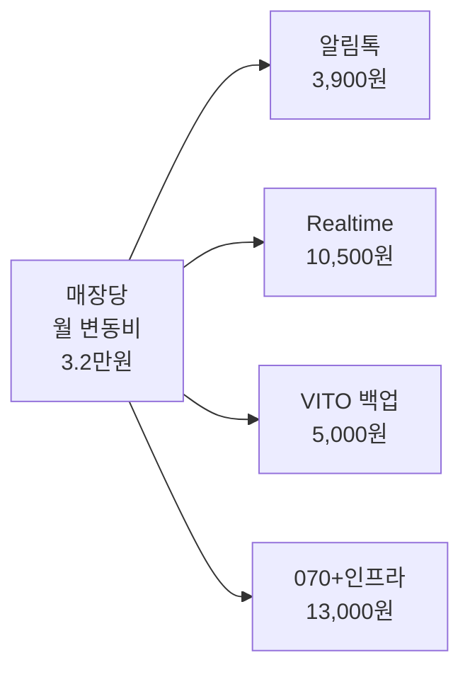

| 항목 | 단가 | 매장당 사용량 | 월 비용 |
|------|------|:------------:|:------:|
| 알림톡 | 13원/건 | 300건 | 3,900원 |
| OpenAI Realtime | 350원/분 | 30분 | 10,500원 |
| VITO STT 백업 | 17원/분 | 작업 메모 | 5,000원 |
| 070 가상번호 | 5,000원/월 | 1회선 | 5,000원 |
| Vercel + Blob | 변동 | 매장당 추정 | 8,000원 |
| **합계** | | | **32,400원** |

### 14.2 매장당 월 손익

| 항목 | 금액 |
|------|:----:|
| SaaS 매출 (정액) | 99,000원 |
| 사용량 패스스루 (마진) | 5,000원 |
| MRO 중개 수수료 (M4+) | 15,000원 |
| **매출 합계** | **119,000원** |
| 변동비 | -32,400원 |
| **매장당 월 마진** | **86,600원** |

### 14.3 회사 차원 손익 (시나리오)

| 매장 수 | 월 매출 | 월 변동비 | 인건비·고정비 | 월 영업이익 |
|:------:|:------:|:--------:|:-----------:|:----------:|
| 50곳 | 595만원 | 162만원 | 2,000만원 | -1,567만원 |
| 200곳 | 2,380만원 | 648만원 | 3,000만원 | -1,268만원 |
| 1,000곳 | 1억 1,900만원 | 3,240만원 | 5,000만원 | +3,660만원 |
| 3,000곳 | 3억 5,700만원 | 9,720만원 | 8,000만원 | +1억 7,980만원 |

> Break-even point ≈ 매장 800곳. 시드 단계에서 12개월 런웨이로 도달 가능한 수치.

### 14.4 CAC (고객 획득 비용) 가정

| 채널 | 매장당 CAC | LTV |
|------|:---------:|:---:|
| 페이스북 페이지 광고 | 8만원 | 240만원 (24개월) |
| 자동차 정비조합 제휴 | 3만원 | 240만원 |
| 매장 추천 (리퍼럴) | 1만원 (1개월 무료) | 240만원 |

LTV/CAC = 30+ (페이스북) / 80+ (조합 제휴) / 240+ (리퍼럴) → 매우 우수.

---

<a id="ch-15"></a>

## 15. 위험 요소·대응 전략

### 15.1 기술 위험

| 위험 | 확률 | 영향 | 대응 |
|------|:---:|:---:|------|
| OpenAI Realtime 한국어 정확도 부족 | 중 | 고 | VITO 백업 자동 폴백 |
| 카카오 알림톡 정책 추가 강화 | 중 | 중 | LMS 백업 + 자체 푸시 |
| 토스페이먼츠 빌링키 거부 (PG 심사) | 저 | 고 | KG이니시스·KCP 대안 사전 계약 |
| Vercel 한국 리전 장애 | 저 | 중 | 정적 데이터 캐시 + 알림 정지 우아 |
| AI 손상 라벨링 정확도 미달 | 고 | 저 | 매장이 수정 가능, 학습 데이터로 활용 |

### 15.2 사업 위험

| 위험 | 확률 | 영향 | 대응 |
|------|:---:|:---:|------|
| 카닥·마이클 같은 B2C 플랫폼이 B2B 진입 | 중 | 고 | 매장 데이터 락인 + 매장 운영 깊이 차별화 |
| 매장 디지털 거부감 | 고 | 고 | NFC 스티커 + 음성 명령 + 5060 친화 UI |
| 외국인 노동자 한국어 UI 한계 | 고 | 중 | Phase 2 다국어 UI |
| 자동차 외관 시장 침체 | 저 | 고 | 보험 정산 자동화로 보험사 락인 |

### 15.3 법적 위험

| 위험 | 대응 |
|------|------|
| AI 통화 고지 누락 행정처분 | 첫 멘트 강제 + 매월 자동 점검 |
| 개인정보 유출 사고 | KISA 사고 대응 매뉴얼 + 보험 가입 |
| 매장-고객 분쟁 (견적 오류) | 매장 책임 명시 + 본 SaaS 면책 약관 |

### 15.4 Circuit Breaker — 출시 보류 조건

다음 중 하나라도 발생하면 출시 일정 재검토:

1. M2 종료 시점 베타 매장 NPS < 20
2. 알림톡 발송 성공률 < 90% (3개월 연속)
3. 토스페이먼츠 PG 심사 거부
4. KISA 보안 점검 통과 실패
5. 카카오 알림톡 채널 인증 거부

---

<a id="ch-16"></a>

## 16. 부록

### 16.1 용어 사전

| 용어 | 정의 |
|------|------|
| 매장 | 휠복원·판금·도색 사업자 단위 |
| 수리 카드 | 차량 1대 1건의 작업 단위 (RepairCard) |
| 칸반 단계 | 7단계 (PENDING~DELIVERED) |
| 표준 공임 | 차종×손상×심각도별 평균 작업비 |
| 정보성 알림톡 | 거래 진행 안내 메시지 (마케팅 X) |
| AI 고지 멘트 | 통화 시작 시 AI 응대 임을 알리는 의무 멘트 |
| MRO | Maintenance/Repair/Operations, 자재 |
| 다이아 컷팅 | 휠 표면을 다이아몬드로 깎는 마감 |
| 비네고 견적 | 흥정 불가 가격 (Non-negotiable) |

### 16.2 알림톡 템플릿 7종 (등록 신청용)

| 코드 | 발송 시점 | 본문 요약 |
|------|----------|----------|
| ARRIVAL | 입고 확정 | 차량 입고 + 견적 발송 예정 |
| ESTIMATE | 견적 발송 | 견적 PDF 링크 |
| START | 작업 시작 | 작업 개시 + 예상 완료일 |
| STAGE | 단계 이동 | 현재 단계 + 진행률 |
| READY | 출고 준비 | 출고 가능 시간 |
| RECEIPT | 영수증 | 결제 완료 + 세금계산서 |
| FOLLOWUP | 출고 D+7 | 만족도 조사 (사전 동의 시) |

### 16.3 AI 통화 시나리오 예시

```
AI: 안녕하세요, OO 휠복원입니다.
    사장님이 도장 작업 중이라
    AI 비서가 안내드립니다.
    통화 내용은 녹음·텍스트화됩니다.
    거부하시려면 # 키를 누르세요.

고객: 네 괜찮아요. 휠 좀 복원하려는데요.

AI: 네, 차종이 어떻게 되시나요?

고객: 그랜저 IG입니다. 좌측 휠이
      연석 긁혀서요.

AI: 그랜저 IG 좌측 휠 연석 손상이군요.
    어느 휠 사이즈인지 아세요?

고객: 18인치요.

AI: 네, 18인치 알루미늄 휠 다이아 컷팅
    복원은 통상 12~15만원 정도이고
    작업은 2일 정도 걸립니다.
    원하시는 입고 날짜 있으세요?

고객: 다음 주 월요일 가능할까요?

AI: 5월 12일 월요일이요.
    오전과 오후 중 어느 쪽이 좋으세요?

고객: 오전이요.

AI: 5월 12일 오전 10시로 가예약
    잡아드리겠습니다. 사장님이
    오시면 확인 후 카카오톡으로
    확정 메시지 보내드릴게요.
    연락처는 발신 번호로 보내드릴게요.
    감사합니다.
```

### 16.4 데이터 마이그레이션 전략 (기존 매장 데이터 흡수)

| 단계 | 처리 |
|:---:|------|
| 1 | 매장 기존 엑셀·종이 장부 사진 촬영 |
| 2 | OCR + LLM 구조화 (매장당 약 30분) |
| 3 | RepairCard·Customer 일괄 import |
| 4 | 매장 검토 + 확정 |
| 5 | 학습 데이터로 표준 공임 누적 |

### 16.5 Changelog (rule 13 호환)

| 날짜 | 버전 | 변경 내용 | 변경 유형 | 결정 근거 |
|------|:----:|----------|----------|----------|
| 2026-05-04 | v2.0 | gemini.md 비판 후 검증 부품으로 전면 재설계 | PRODUCT | 가짜 API·비용 환상·정책 충돌·법적 누락 동시 해소 |
| 2026-05-04 | v1.0 | 원본 gemini.md (참조용) | - | 초기 발상 |

### 16.6 다음 액션 (사용자 결정 영역)

이 PRD가 v2.0 DRAFT입니다. 사용자 승인 후 다음 산출물로 전개됩니다.

| 단계 | 산출물 | 위치 |
|:---:|--------|------|
| 1 | Phase 1 화면 와이어프레임 | `docs/02-design/wheel-on-screens.md` |
| 2 | API 계약 (OpenAPI 3.1) | `docs/02-design/wheel-on-api.yaml` |
| 3 | 데이터 마이그레이션 스크립트 | `apps/api/migrations/` |
| 4 | M1 작업 분해 (Atomic Tasks) | `docs/01-plan/m1-tasks.md` |
| 5 | 백로그 캡처 | `docs/backlog.md` |

> 사용자가 "v2.0 승인"이라고 답하면 위 1~5번을 자율 실행합니다.

---

**END OF PRD v2.0**


