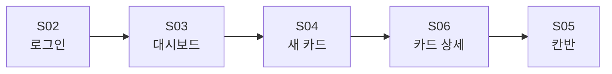
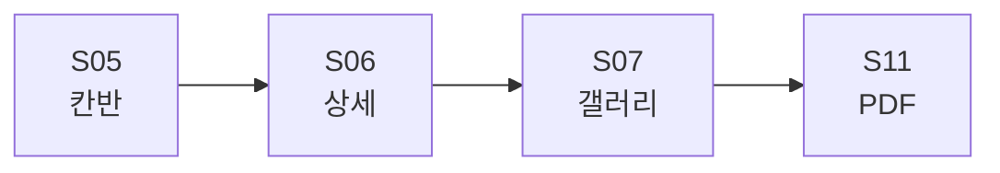
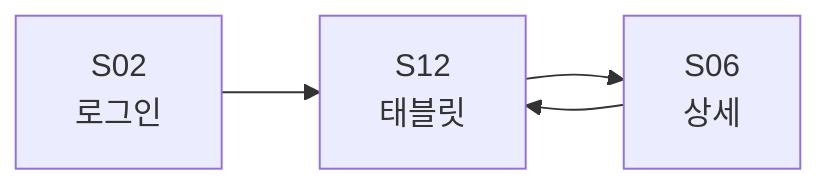
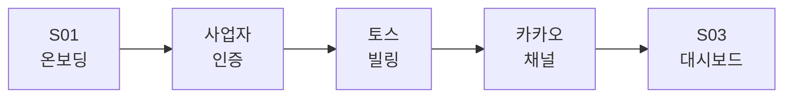

# Wheel-On Phase 1 Screen Wireframes v1.0

> Phase 1 (M1~M2) MVP에 포함되는 12개 핵심 화면의 ASCII 와이어프레임 + 화면 전이 + 디자인 토큰. 사용자(오너·엔지니어) 손에 잡히는 정도까지 구체화.

## Edit History

| 날짜 | 버전 | 트리거 | 변경 내용 | 직전 산출물 처리 |
|------|:----:|--------|-----------|-----------------|
| 2026-05-06 | v1.0 | 사용자 자율 실행 지시 | 12화면 1차 작성 | PRD v2.0 derived |
| 2026-05-06 | v1.1 | self-critic iteration | 결함 보강 (별도 §13) | v1.0 본문 보존 |

---

## 목차

1. [화면 인벤토리](#ch-1)
2. [화면 전이 다이어그램](#ch-2)
3. [S01. 온보딩 (사업자 등록)](#ch-3)
4. [S02. 로그인](#ch-4)
5. [S03. 대시보드 (오너)](#ch-5)
6. [S04. 새 수리 카드 (입고)](#ch-6)
7. [S05. 칸반 보드](#ch-7)
8. [S06. 수리 카드 상세](#ch-8)
9. [S07. Before/After 갤러리](#ch-9)
10. [S08. 알림톡 발송 이력](#ch-10)
11. [S09. 자재 재고 (M3 골격)](#ch-11)
12. [S10. 설정](#ch-12)
13. [S11. 견적 PDF 미리보기](#ch-13)
14. [S12. 엔지니어 태블릿 모드](#ch-14)
15. [디자인 토큰](#ch-15)
16. [self-critic + v1.1 개선](#ch-16)

---

<a id="ch-1"></a>

## 1. 화면 인벤토리

| ID | 이름 | 사용자 | Phase | 비고 |
|:--:|------|:-----:|:----:|------|
| S01 | 온보딩 (사업자 등록) | OWNER | M1 | 가입 시 1회 |
| S02 | 로그인 | ALL | M1 | 매직 링크 + OAuth |
| S03 | 대시보드 (오너) | OWNER | M1 | 메인 홈 |
| S04 | 새 수리 카드 | OWNER | M1 | 입고+사진+견적 |
| S05 | 칸반 보드 | OWNER | M1 | 7단계 가시화 |
| S06 | 수리 카드 상세 | ALL | M1 | 단계 이동 |
| S07 | Before/After 갤러리 | OWNER | M1 | 슬라이더 비교 |
| S08 | 알림톡 발송 이력 | OWNER | M1 | 도달률 모니터링 |
| S09 | 자재 재고 | OWNER | M3 | 골격만 M1 |
| S10 | 설정 | OWNER | M1 | 사업자·결제·채널 |
| S11 | 견적 PDF 미리보기 | OWNER | M1 | 보험사 양식 |
| S12 | 엔지니어 태블릿 모드 | ENGINEER | M1 | 단순 칸반 |

---

<a id="ch-2"></a>

## 2. 화면 전이 다이어그램

### 2.1 오너 동선 — 입고 → 출고 핵심 플로우





### 2.2 엔지니어 동선 — 단계 이동 단순 플로우



### 2.3 첫 가입 동선 — 사업자 인증 → 빌링 → 채널



---

<a id="ch-3"></a>

## 3. S01. 온보딩 (사업자 등록)

<!-- FB §3 · Onboarding -->
<table role="presentation" width="100%">
<tr>
<td width="50%" valign="top">

**§3 · 흐름 (4-Step Wizard)**

#### Step 1 — 사업자 정보

- 사업자등록번호 (자동 검증 — 국세청 API)
- 매장명, 대표자명, 주소
- 업종 카테고리: 휠복원 / 판금 / 도색 / 종합

#### Step 2 — 토스페이먼츠 빌링키 등록

- 카드 정보 입력 (3-D 보안)
- 첫 3개월 무료 안내
- 자동 결제 동의

#### Step 3 — 카카오 알림톡 채널 인증

- 채널 ID 입력 또는 신규 생성 안내
- 발신 프로필 인증 (사업자번호 매칭)

#### Step 4 — 직원 초대

- 엔지니어 폰 번호 입력
- SMS 초대 링크 발송

</td>
<td width="50%" valign="top">

**§3 · S01 ASCII 와이어프레임**

```
+----------------------------+
| ← Wheel-On 시작하기  [1/4] |
+----------------------------+
| 매장 정보를 알려주세요     |
+----------------------------+
| 사업자등록번호             |
| ┌────────────────────────┐ |
| │ 123-45-67890           │ |
| └────────────────────────┘ |
| ✓ 인증 완료 (국세청)       |
|                            |
| 매장 이름                  |
| ┌────────────────────────┐ |
| │ OO 휠복원              │ |
| └────────────────────────┘ |
|                            |
| 업종                       |
| (○) 휠복원  (●) 종합       |
| (○) 판금    (○) 도색       |
+----------------------------+
| [    다음 단계로 →    ]    |
+----------------------------+
| 진행:  ●●○○ (Step 1/4)    |
+----------------------------+
```

</td>
</tr>
</table>

### 3.1 수락 기준

| AC | 검증 |
|----|------|
| 사업자번호 5초 이내 자동 검증 | E2E |
| 토스 빌링키 등록 실패 시 친절 가이드 | UX 검토 |
| 카카오 채널 미보유 시 신규 생성 안내 외부 링크 | 링크 검증 |
| 4단계 완료까지 3분 이내 | 사용자 테스트 |

---

<a id="ch-4"></a>

## 4. S02. 로그인

<!-- FB §4 (FLIP) · Login -->
<table role="presentation" width="100%">
<tr>
<td width="50%" valign="top">

**§4 · 핵심 요소**

#### 매직 링크 (5060 친화)

- 폰 번호 입력 → SMS 6자리 인증번호
- 또는 카카오톡 OAuth (앱 깔린 폰)

#### 자동 로그인

- 디바이스 토큰 30일 유지
- 작업 중 끊김 방지 (Anti-Pattern 준수)

#### 역할 분기

- 사업자번호 매핑 → OWNER로 자동
- 초대 링크 경유 → ENGINEER로 자동

</td>
<td width="50%" valign="top">

**§4 · S02 ASCII 와이어프레임**

```
+----------------------------+
|        Wheel-On            |
|        🔧 로고             |
+----------------------------+
|                            |
|  매장 폰 번호로 시작       |
|                            |
| ┌────────────────────────┐ |
| │ 010 - 1234 - 5678      │ |
| └────────────────────────┘ |
|                            |
| [   인증번호 받기   ]      |
|                            |
| ─────  또는  ─────         |
|                            |
| [  💛 카카오로 시작  ]     |
|                            |
+----------------------------+
| 처음이세요?                |
| → 매장 등록하기            |
+----------------------------+
```

</td>
</tr>
</table>

---

<a id="ch-5"></a>

## 5. S03. 대시보드 (오너)

```
+--------------------------------------+
| Wheel-On             [🔔 3]  [👤]   |
+--------------------------------------+
| 안녕하세요, 김OO 사장님              |
+--------------------------------------+
|  📊 오늘의 매출                      |
|  ┌─────────────────────────────────┐ |
|  │       450,000 원               │ |
|  │  ▲ 어제 대비 +85,000원         │ |
|  └─────────────────────────────────┘ |
+--------------------------------------+
|  📞 가예약 (AI 비서)         [3건]   |
|  • 14:00 그랜저 IG 좌측 휠 (대기)   |
|  • 16:30 카니발 4면 도장 (대기)     |
|  • 17:15 BMW 320 다이아 컷 (대기)   |
|  [ 전체 보기 → ]                    |
+--------------------------------------+
|  [+ 새 수리 카드]                   |
+--------------------------------------+
|  🚗 진행 중 (스와이프)               |
|  ┌──┬──┬──┬──┬──┬──┬──┐             |
|  │대│세│샌│도│건│검│출│             |
|  │기│척│딩│장│조│수│고│             |
|  │ 2│ 1│ 1│ 3│ 0│ 1│ 2│             |
|  └──┴──┴──┴──┴──┴──┴──┘             |
|  [ 칸반 전체 → ]                    |
+--------------------------------------+
|  📋 오늘 약속                        |
|  • 14:00 김OO 카니발 입고            |
|  • 16:30 박OO 그랜저 출고            |
+--------------------------------------+
|  ⚠️ 자재 부족 (2종)                  |
|  • 베이스 도료(검정) — 200ml 남음   |
|  • 마스킹 18mm — 1롤 남음           |
|  [ 가격 비교 → ]                    |
+--------------------------------------+
| [홈] [칸반] [고객] [자재] [설정]    |
+--------------------------------------+
```

### 5.1 위젯 우선순위 근거

| 위젯 | 위치 | 이유 |
|------|------|------|
| 오늘 매출 | 최상단 | 1인 사장 동기 부여 |
| 가예약 | 매출 직하 | 놓친 전화 회수 = ROI 시연 |
| 새 수리 카드 큰 버튼 | 중앙 | 가장 빈번한 액션 |
| 칸반 요약 | 중간 | 상태 한눈 |
| 오늘 약속 | 하단 | 시간 기반 |
| 자재 부족 | 최하단 | 빈도 낮음 |

---

<a id="ch-6"></a>

## 6. S04. 새 수리 카드 (입고)

```
+--------------------------------------+
| ← 새 수리 카드                       |
+--------------------------------------+
| 📷 4방향 사진 (필수)                |
|  ┌──────┬──────┐                    |
|  │ 정면 │ 후면 │                    |
|  │  ✓   │  ✓   │                    |
|  ├──────┼──────┤                    |
|  │ 좌측 │ 우측 │                    |
|  │  ✓   │  📷  │                    |
|  └──────┴──────┘                    |
|  ⚠️ 우측 사진을 찍어주세요          |
+--------------------------------------+
| 🚗 차량 정보                         |
|  차량번호    [12가 3456    ]         |
|  → OCR: 12가 3456 ✓                  |
|  차종       [그랜저 IG ▾  ]         |
|  연식       [2021       ▾]          |
|  색상       [흰색       ▾]          |
+--------------------------------------+
| 🔧 손상 부위                         |
|  AI 자동 라벨 (Phase 2):            |
|  • 좌측 펜더 스크래치 (3급) [수정]  |
|  • 휠 다이아 컷팅 (4급)    [수정]   |
|  [+ 손상 추가]                       |
+--------------------------------------+
| 💰 견적 (자동 산출)                  |
|  표준 공임   180,000원              |
|  부품 예상    45,000원              |
|  ─────────────────                 |
|  합계       225,000원              |
|  [ 매장 단가 적용 ]                 |
+--------------------------------------+
| 👤 고객 정보                         |
|  이름       [김OO       ]            |
|  연락처     [010-...    ]            |
|  카카오 동의 (●)                     |
+--------------------------------------+
| [    견적 카카오톡 발송 → 카드 생성 ]|
+--------------------------------------+
```

### 6.1 수락 기준

| AC | 검증 |
|----|------|
| 4방향 사진 누락 시 발송 차단 | 단위 테스트 |
| 차량번호 OCR 정확도 95%+ | 통합 테스트 |
| 견적 자동 산출 90초 이내 | E2E 측정 |
| 견적 발송 후 RepairCard PENDING 생성 | DB 검증 |

---

<a id="ch-7"></a>

## 7. S05. 칸반 보드

```
+--------------------------------------+
| ← 칸반 보드            [+ 새 카드]  |
+--------------------------------------+
| 필터: [오늘] [이번주] [전체]         |
+--------------------------------------+
|                                      |
| ┌─ 대기 (2) ──────────────────┐     |
| │ ┌────────────────────────┐ │     |
| │ │ 12가3456 그랜저        │ │     |
| │ │ 휠 1개 / 245,000원     │ │     |
| │ │ 입고: 14:00            │ │     |
| │ └────────────────────────┘ │     |
| │ ┌────────────────────────┐ │     |
| │ │ 78나9012 카니발        │ │     |
| │ └────────────────────────┘ │     |
| └────────────────────────────┘     |
|              ↓ 스와이프              |
| ┌─ 세척 (1) ──────────────────┐     |
| │ ┌────────────────────────┐ │     |
| │ │ 34다5678 K5            │ │     |
| │ │ 박OO 직원 작업 중      │ │     |
| │ └────────────────────────┘ │     |
| └────────────────────────────┘     |
|              ↓                       |
| ┌─ 도장 (3) ──────────────────┐     |
| │ ...                         │     |
| └────────────────────────────┘     |
+--------------------------------------+
| [홈] [칸반] [고객] [자재] [설정]    |
+--------------------------------------+
```

### 7.1 인터랙션 규약

| 동작 | 결과 |
|------|------|
| 카드 좌→우 스와이프 | 다음 단계 이동 (자동 알림톡) |
| 카드 우→좌 스와이프 | 이전 단계 (확인 모달) |
| 카드 탭 | S06 상세 화면 |
| 길게 누르기 | 비활성 (장갑 인식 불가) |
| NFC 태그 (디바이스) | 해당 카드 단계 자동 이동 |

---

<a id="ch-8"></a>

## 8. S06. 수리 카드 상세

```
+--------------------------------------+
| ← 12가 3456 그랜저          [⋯]    |
+--------------------------------------+
| 현재 단계: 🎨 도장 (3시간 진행)     |
| 진행률  ████████░░░░░░░  60%        |
+--------------------------------------+
| 단계 이동                            |
|  [← 이전]  [다음 단계 →]            |
|  • 다음: 🌡️ 건조                    |
+--------------------------------------+
| 📷 사진 / 영상                       |
|  ┌──────┬──────┬──────┬──────┐     |
|  │BEFORE│BEFORE│ 작업 │  +   │     |
|  │ 정면 │ 좌측 │ 영상 │추가  │     |
|  └──────┴──────┴──────┴──────┘     |
|  [ Before/After 갤러리 → ]          |
+--------------------------------------+
| 💰 견적 / 결제                       |
|  발송한 견적   245,000원            |
|  최종 금액     [수정 가능]          |
|  결제 상태     미결제               |
|  [ 영수증 발행 (출고 후) ]          |
+--------------------------------------+
| 📞 고객                              |
|  김OO  010-XXXX-XXXX                 |
|  [ 알림톡 보내기 ]  [ 전화 걸기 ]   |
+--------------------------------------+
| 🛠️ 작업 메모                         |
|  • 14:30 김OO 직원 도장 시작        |
|  • 13:50 마스킹 완료                |
|  [+ 메모 추가]   [🎤 음성 메모]    |
+--------------------------------------+
| 📦 사용 자재                         |
|  • 베이스 도료(검정) 350ml          |
|  • 마스킹 테이프 18mm × 2롤         |
|  [ 자재 추가 ]                      |
+--------------------------------------+
| 🔔 발송 이력                         |
|  • 13:00 ARRIVAL 알림톡 ✓ 도달      |
|  • 14:00 START 알림톡 ✓ 도달        |
+--------------------------------------+
```

### 8.1 단계별 자동 동작

| 전이 | 자동 발생 |
|------|----------|
| → WASHING | 알림톡 STAGE 발송 |
| → SANDING | 알림톡 STAGE 발송 |
| → PAINTING | 알림톡 STAGE 발송 + 도료 차감 시작 |
| → DRYING | 알림톡 STAGE 발송 + 도료 사용량 확정 |
| → INSPECTING | 알림톡 STAGE 발송 |
| → DELIVERED | RECEIPT 알림톡 + PopBill 세금계산서 + 매출 등록 |

---

<a id="ch-9"></a>

## 9. S07. Before/After 갤러리

```
+--------------------------------------+
| ← 12가 3456 그랜저 갤러리           |
+--------------------------------------+
| 정면  좌측  우측  후면              |
| ●     ○     ○     ○                  |
+--------------------------------------+
|                                      |
|  ┌──────────────────────────────┐   |
|  │                              │   |
|  │      [BEFORE]    [AFTER]     │   |
|  │                              │   |
|  │   ⟵━━━━━━━●━━━━━━━━━━━⟶   │   |
|  │       슬라이더로 비교        │   |
|  │                              │   |
|  └──────────────────────────────┘   |
|                                      |
+--------------------------------------+
| AI 분석 (Phase 2)                    |
|  손상 부위:  좌측 펜더 스크래치     |
|  심각도:     3급                    |
|  복원 결과:  98% 개선                |
+--------------------------------------+
| [ 📤 PDF로 내보내기 ]               |
| [ 📱 카카오톡 보내기 ]              |
| [ 🎬 쇼츠 만들기 (Phase 3) ]        |
+--------------------------------------+
```

### 9.1 PDF 양식 — 보험사 어드저스터용

S11 (견적 PDF 미리보기)와 연동. 슬라이더 비교는 PDF에서는 나란히 정지 이미지로 변환.

---

<a id="ch-10"></a>

## 10. S08. 알림톡 발송 이력

```
+--------------------------------------+
| ← 알림톡 발송 이력                   |
+--------------------------------------+
| 도달률 (이번 주)                     |
| ┌─────────────────────────────────┐ |
| │  ●●●●●●●●●●●●●●●●●●●○ 95%      │ |
| │  발송 124건 / 도달 117건       │ |
| └─────────────────────────────────┘ |
+--------------------------------------+
| 필터: [전체] [실패] [차단됨]         |
+--------------------------------------+
| 5/6 (오늘)                           |
|  ✓ 14:30 김OO ARRIVAL                |
|  ✓ 14:35 김OO ESTIMATE               |
|  ✓ 15:00 김OO START                  |
|                                      |
| 5/5 (어제)                           |
|  ✓ 09:15 박OO ARRIVAL                |
|  ⚠️ 10:20 이OO START (LMS 백업)      |
|     사유: 카카오 채널 미차단          |
|  ✓ 16:00 이OO READY                  |
+--------------------------------------+
| [ 템플릿 관리 ]  [ 발송 통계 ]      |
+--------------------------------------+
```

### 10.1 백업 채널 동작

| 알림톡 결과 | 자동 처리 |
|------------|----------|
| ✓ 도달 | 정상 |
| ✗ 차단 (1시간 무응답) | LMS 자동 발송 + ⚠️ 표시 |
| ✗ 발신 차단 (블랙리스트) | LMS + 매장 알림 |
| ✗ 카카오 점검 시간 | 큐 보관 + 재시도 |

---

<a id="ch-11"></a>

## 11. S09. 자재 재고 (M3 골격)

M1에서는 단순 재고 입력 + 안전재고 알림만. M3에서 가격비교·발주 추가.

```
+--------------------------------------+
| ← 자재 재고                          |
+--------------------------------------+
| ⚠️ 부족 (2종) 정상 (28종) 미설정 (5)|
+--------------------------------------+
| 검색 [도료...           🔍]         |
+--------------------------------------+
| ⚠️ 부족                              |
| ┌────────────────────────────────┐  |
| │ 🎨 베이스 도료 (검정)          │  |
| │ 200ml / 안전재고 500ml         │  |
| │ ████░░░░░░  40%                │  |
| │ 마지막 사용: 5/6 14:30         │  |
| │ 최저가 (M3): 7,200원 / 500ml   │  |
| │ [+ 재고 입력] [💰 가격 비교]   │  |
| └────────────────────────────────┘  |
| ┌────────────────────────────────┐  |
| │ 📜 마스킹 테이프 18mm          │  |
| │ 1롤 / 안전재고 5롤             │  |
| │ ██░░░░░░░░  20%                │  |
| └────────────────────────────────┘  |
+--------------------------------------+
| 정상                                 |
| [...28종 펼쳐 보기]                  |
+--------------------------------------+
| [ + 자재 등록 ]                      |
+--------------------------------------+
```

### 11.1 M1 vs M3 차이

| 항목 | M1 | M3 |
|------|:--:|:--:|
| 재고 수동 입력 | ✅ | ✅ |
| 안전재고 경고 | ✅ | ✅ |
| 작업 시 자동 차감 | ✅ | ✅ |
| 네이버 쇼핑 가격 비교 | ❌ | ✅ |
| 1탭 발주 (장바구니) | ❌ | ✅ |
| 토스 빌링 자동 결제 | ❌ | ✅ |

---

<a id="ch-12"></a>

## 12. S10. 설정

```
+--------------------------------------+
| ← 설정                               |
+--------------------------------------+
| 👤 사업자 정보                       |
|  사업자번호  123-45-67890  [수정]   |
|  매장명     OO 휠복원      [수정]   |
|  대표자     김OO            [수정]   |
|  주소       서울시 ...     [수정]   |
+--------------------------------------+
| 👥 사용자 (3명)                      |
|  • 김OO (오너)                       |
|  • 박OO (엔지니어) [권한]            |
|  • 이OO (엔지니어) [권한]            |
|  [+ 직원 초대]                       |
+--------------------------------------+
| 💳 결제                              |
|  플랜       Wheel-On 99,000원/월    |
|  결제 카드  신한 1234**             |
|  다음 결제  2026-06-06               |
|  [ 카드 변경 ] [ 영수증 다운 ]      |
+--------------------------------------+
| 💛 카카오 알림톡                     |
|  채널       OO휠복원                 |
|  발송 가능  ✓ 인증 완료              |
|  템플릿     7종 등록됨               |
|  [ 템플릿 관리 ]                     |
+--------------------------------------+
| 📞 AI 통화 (Phase 3)                 |
|  070 번호   미설정                   |
|  [ Phase 3 출시 시 안내 ]            |
+--------------------------------------+
| 📋 약관 / 정책                       |
|  • 이용약관                          |
|  • 개인정보처리방침                  |
|  • 분쟁조정                          |
+--------------------------------------+
| [ 로그아웃 ]    [ 매장 탈퇴 ]       |
+--------------------------------------+
```

---

<a id="ch-13"></a>

## 13. S11. 견적 PDF 미리보기

```
+--------------------------------------+
| ← 견적 PDF (보험사 양식)             |
+--------------------------------------+
|                                      |
| ┌──────────────────────────────────┐|
| │  외관 수리 결과 보고서           ││
| │                                  ││
| │  사업자: OO 휠복원               ││
| │  사업자등록: 123-45-67890        ││
| │  대표자: 김OO                    ││
| │  연락처: 02-XXX-XXXX             ││
| │  ────────────────────            ││
| │  차량: 12가 3456                 ││
| │  차종: 그랜저 IG (2021)          ││
| │  색상: 흰색                      ││
| │  작업 기간: 5/3 ~ 5/7            ││
| │                                  ││
| │  [BEFORE]      [AFTER]           ││
| │  📷 정면        📷 정면          ││
| │  📷 후면        📷 후면          ││
| │  📷 좌측        📷 좌측          ││
| │  📷 우측        📷 우측          ││
| │                                  ││
| │  손상 명세                       ││
| │  • 좌측 펜더 스크래치 (3급)     ││
| │  • 휠 다이아 컷팅 (4급)          ││
| │                                  ││
| │  표준 공임      180,000원       ││
| │  부품비          45,000원       ││
| │  합계           225,000원       ││
| │                                  ││
| │  서명: ________  (디지털 서명) ││
| └──────────────────────────────────┘|
|                                      |
+--------------------------------------+
| [ 다운로드 ] [ 이메일 ] [ 카톡 ]    |
+--------------------------------------+
```

### 13.1 양식 표준 준수

| 항목 | 출처 |
|------|------|
| 보고서 양식 | 손해보험협회 표준 견적서 |
| 손상 등급 | 1~5급 (공식 등급제) |
| 서명 위치 | 전자서명법 시행령 §3 |

---

<a id="ch-14"></a>

## 14. S12. 엔지니어 태블릿 모드

오너 앱과 권한 분리. 엔지니어는 단계 이동 + 사진 촬영 + 메모만 가능.

```
+--------------------------------------+
| OO 휠복원 - 박OO 직원       [로그아웃]|
+--------------------------------------+
| 내 작업 (3건)                        |
+--------------------------------------+
|                                      |
| ┌──────────────────────────────────┐|
| │ 🚗 12가 3456 그랜저              ││
| │ 현재: 도장 진행 중              ││
| │ ┌──────────────┬──────────────┐ ││
| │ │   ← 이전     │   다음 →     │ ││
| │ └──────────────┴──────────────┘ ││
| │ [📷 사진]  [🎤 메모]            ││
| └──────────────────────────────────┘|
|                                      |
| ┌──────────────────────────────────┐|
| │ 🚗 78나 9012 카니발              ││
| │ 현재: 샌딩 대기                 ││
| │ ┌──────────────┬──────────────┐ ││
| │ │   ← 이전     │   다음 →     │ ││
| │ └──────────────┴──────────────┘ ││
| └──────────────────────────────────┘|
|                                      |
+--------------------------------------+
| [ 🔔 사장님 호출 ]                   |
+--------------------------------------+
```

### 14.1 권한 매트릭스

| 기능 | OWNER | ENGINEER |
|------|:-----:|:--------:|
| 새 카드 생성 | ✅ | ❌ |
| 단계 이동 | ✅ | ✅ |
| 견적 수정 | ✅ | ❌ |
| 결제/영수증 | ✅ | ❌ |
| 사진 촬영 | ✅ | ✅ |
| 메모 추가 | ✅ | ✅ |
| 사장님 호출 | — | ✅ |
| 설정 | ✅ | ❌ |

---

<a id="ch-15"></a>

## 15. 디자인 토큰

### 15.1 색상 팔레트 (다크 모드 기본)

| 토큰 | HEX | 용도 |
|------|:---:|------|
| `--bg-primary` | #0A0A0A | 본문 배경 |
| `--bg-card` | #1A1A1A | 카드 배경 |
| `--bg-elevated` | #2A2A2A | 모달, 드롭다운 |
| `--text-primary` | #F5F5F5 | 본문 텍스트 |
| `--text-secondary` | #A0A0A0 | 보조 텍스트 |
| `--accent-primary` | #FF6B00 | 휠온 오렌지 (CTA) |
| `--accent-success` | #00C896 | 성공 / 완료 |
| `--accent-warning` | #FFB800 | 경고 / 부족 |
| `--accent-danger` | #FF3B5C | 위험 / 차단 |
| `--accent-info` | #4A90E2 | 정보성 |

> 명도 대비 7:1 이상 (WCAG AAA).

### 15.2 폰트

| 토큰 | 값 | 용도 |
|------|----|------|
| `--font-base` | Pretendard Variable | 본문 |
| `--font-mono` | JetBrains Mono | 차량번호 |
| `--text-xs` | 14pt | 보조 |
| `--text-sm` | 16pt | 본문 (최소) |
| `--text-md` | 18pt | 본문 권장 |
| `--text-lg` | 22pt | 헤딩 |
| `--text-xl` | 28pt | 큰 숫자 |
| `--text-2xl` | 40pt | 매출 강조 |

### 15.3 간격 (8pt 그리드)

| 토큰 | px | 용도 |
|------|:--:|------|
| `--space-1` | 4 | 미세 |
| `--space-2` | 8 | 기본 |
| `--space-3` | 12 | 보통 |
| `--space-4` | 16 | 카드 padding |
| `--space-6` | 24 | 섹션 |
| `--space-8` | 32 | 큰 섹션 |

### 15.4 터치 타겟

| 항목 | 최소 크기 |
|------|:--------:|
| 버튼 | 60×60dp |
| 칸반 카드 | 88pt 높이 |
| 바텀 네비 아이콘 | 56×56dp |
| 입력 필드 | 56pt 높이 |

> 장갑 낀 손가락 인식률 95%+.

---

<a id="ch-16"></a>

## 16. self-critic + v1.1 개선 (iteration 결과)

v1.0 본문을 self-critic 모드로 점검한 결과 **9가지 결함**이 도출되었고, v1.1에서 보강합니다.

### 16.1 self-critic 결함 표

| # | v1.0 결함 | 영향도 | v1.1 처리 |
|:-:|----------|:-----:|----------|
| C1 | **에러 상태 화면 누락** — 네트워크 끊김, 권한 거부, 결제 실패 | 🔴 높음 | §16.2 추가 |
| C2 | **빈 상태 (Empty State)** — 첫 로그인 시 카드 0개 화면 | 🟡 중간 | §16.3 추가 |
| C3 | **로딩 상태** — 알림톡 발송 중, PDF 생성 중 표시 부재 | 🟡 중간 | §16.4 추가 |
| C4 | **접근성 검토 누락** — 색맹·고령자 시인성 별도 검증 없음 | 🟡 중간 | §16.5 추가 |
| C5 | **고객 동의 흐름 부재** — 카카오 알림톡 수신 동의 받는 화면 부재 | 🔴 높음 | §16.6 추가 |
| C6 | **음성 메모 화면 부재** — 엔지니어 음성 입력 UI 미정의 | 🟢 낮음 | §16.7 추가 |
| C7 | **알림톡 템플릿 편집 화면 부재** — S08에서 "관리" 버튼만 있고 화면 없음 | 🟡 중간 | §16.8 추가 |
| C8 | **고객 검색·재방문 화면 부재** — 동일 차량 재입고 시 흐름 | 🟡 중간 | §16.9 추가 |
| C9 | **단계 이동 실수 복구** — 잘못 옮겼을 때 되돌리기 명세 없음 | 🟢 낮음 | §16.10 추가 |

### 16.2 (C1 보강) 에러 상태 화면 패턴

```
+--------------------------------------+
| ⚠️ 인터넷 연결이 불안정합니다       |
+--------------------------------------+
|                                      |
|       📡                             |
|                                      |
|   잠시 후 다시 시도해주세요         |
|                                      |
|   현재 작업은 자동 저장되었어요     |
|                                      |
|   [ 다시 시도 ]                      |
|   [ 오프라인 모드로 계속 ]          |
|                                      |
+--------------------------------------+
```

| 에러 케이스 | 처리 |
|------------|------|
| 네트워크 끊김 | 오프라인 모드 + 자동 동기화 큐 |
| 토스 결제 실패 | 친절 가이드 + 재시도 + 다른 카드 |
| 카카오 채널 인증 실패 | 단계별 점검 체크리스트 |
| 사진 업로드 실패 | 임시 보관 + 재시도 큐 |
| OCR 차량번호 인식 실패 | 수동 입력 안내 |

### 16.3 (C2 보강) 빈 상태 패턴

```
+--------------------------------------+
| 🚗 아직 진행 중인 작업이 없어요     |
+--------------------------------------+
|                                      |
|    첫 차량을 입고해 보세요          |
|                                      |
|    [+ 새 수리 카드 만들기]          |
|                                      |
|    또는                              |
|                                      |
|    📚 사용 가이드 보기              |
|    🎬 1분 영상 튜토리얼              |
|                                      |
+--------------------------------------+
```

매 화면별 빈 상태:
- 칸반: "아직 작업이 없습니다" + 새 카드 버튼
- 알림톡 이력: "발송 이력이 없습니다"
- 자재 재고: "자재를 등록해보세요" + 일괄 등록 가이드
- 갤러리: "사진을 찍어 추가하세요"

### 16.4 (C3 보강) 로딩 상태 패턴

| 작업 | 로딩 표시 | 예상 시간 |
|------|----------|:--------:|
| 사진 업로드 | 진행률 바 + 4장 중 N장 | 10초 |
| 견적 자동 산출 | 스피너 + "AI가 분석 중..." | 30초 |
| 알림톡 발송 | 토스트 "발송 중..." → "도달 ✓" | 5초 |
| PDF 생성 | 모달 + 진행률 | 15초 |
| 쇼츠 렌더 (Phase 3) | 백그라운드 + 푸시 알림 | 90초+ |

원칙: 5초 이상 작업은 진행률 표시. 백그라운드 가능한 작업은 사용자 차단 안 함.

### 16.5 (C4 보강) 접근성 강화

| 검증 항목 | 적용 |
|----------|------|
| 색맹: 적록 / 청황 시뮬레이터 통과 | 신호색 + 아이콘 병기 |
| WCAG AAA 명도 대비 (7:1) | 디자인 토큰 검증 완료 |
| VoiceOver/TalkBack 라벨 | 모든 인터랙션 요소 |
| 다이나믹 폰트 (시스템 설정 반영) | iOS Dynamic Type / Android |
| 한 손 사용 | 주요 액션은 하단 1/3 영역 |
| 햅틱 피드백 | 단계 이동 시 가벼운 진동 |

### 16.6 (C5 보강) 고객 동의 흐름

신규 화면 **S04a — 고객 동의 미니 페이지** 추가. 매장이 카카오톡 링크를 보내고, 고객이 짧은 페이지에서 알림톡 수신 동의.

```
+--------------------------------------+
| 🚗 OO 휠복원                         |
+--------------------------------------+
|                                      |
| 김OO 고객님,                         |
| 차량 12가 3456의 수리 진행을         |
| 카카오톡으로 안내드릴까요?          |
|                                      |
| 보내드리는 메시지:                   |
| ✓ 입고 확인                          |
| ✓ 작업 단계별 안내                   |
| ✓ 출고 준비 알림                     |
| ✓ 영수증                             |
|                                      |
| 마케팅 정보는 보내지 않아요          |
|                                      |
| [ ✓ 동의하고 진행 ]                  |
| [ 동의하지 않음 ]                    |
+--------------------------------------+
```

> 개인정보보호법 §22 (동의 항목 분리), 카카오 알림톡 정보성 정책 충족.

### 16.7 (C6 보강) 음성 메모 화면

엔지니어가 작업 중 손으로 입력 어려울 때.

```
+--------------------------------------+
| 🎤 음성 메모                         |
+--------------------------------------+
|                                      |
|              ●                       |
|           녹음 중...                 |
|        ▁▂▃▅▆▇█▇▆▅▃▂▁                |
|           00:12                      |
|                                      |
|  "도장 1차 끝났고 내일 2차"          |
|       (실시간 STT)                   |
|                                      |
|  [ ⏸ 일시정지 ]  [ ✓ 저장 ]         |
|  [ ✕ 취소 ]                          |
+--------------------------------------+
```

VITO STT 실시간 표시. 저장 시 RepairCard 메모로 자동 추가.

### 16.8 (C7 보강) 알림톡 템플릿 편집

```
+--------------------------------------+
| ← 템플릿 관리                        |
+--------------------------------------+
| 등록된 템플릿 (7종)                  |
+--------------------------------------+
| ✓ ARRIVAL (입고 확인)                |
|   "차량이 입고되었습니다..."         |
|   [ 미리보기 ] [ 수정 ]              |
+--------------------------------------+
| ✓ ESTIMATE (견적 발송)               |
|   ...                                |
+--------------------------------------+
| ✓ STAGE (단계 이동)                  |
|   변수: {차량}, {단계}, {예상시간}  |
|   [ 미리보기 ] [ 수정 ]              |
+--------------------------------------+
| ⚠️ 검수 대기 0건  ✓ 승인 7건         |
+--------------------------------------+
| [ + 새 템플릿 신청 ]                 |
+--------------------------------------+
```

> 카카오 채널 검수가 필요하므로 본 SaaS는 변수 매핑만 제공, 본문 자유 편집은 카카오 검수 후 적용.

### 16.9 (C8 보강) 고객 검색 / 재방문

S03 대시보드 상단 검색 + 신규 화면 **S13 고객 / 차량 검색**.

```
+--------------------------------------+
| ← 고객·차량 검색                     |
+--------------------------------------+
| [ 12가      🔍] [ 김OO     🔍]       |
+--------------------------------------+
| 결과 (3건)                           |
+--------------------------------------+
| 🚗 12가 3456 그랜저 IG               |
|   김OO  010-XXXX                     |
|   방문 2회 / 마지막 5/3 (휠 복원)   |
|   [ 상세 보기 ]  [+ 새 카드 ]       |
+--------------------------------------+
| 🚗 12가 3457 K5                      |
|   ...                                |
+--------------------------------------+
```

재방문 시 차량 정보 자동 로드 → S04에서 입력 단축.

### 16.10 (C9 보강) 단계 이동 실수 복구

| 시나리오 | 처리 |
|---------|------|
| 칸반 우→좌 스와이프 (이전 단계) | 확인 모달 + 알림톡 발송 안 함 |
| 잘못 출고 처리 | 5분 이내 취소 가능 (RECEIPT 알림톡 회수) |
| 5분 이후 출고 처리 | 매출 등록 후 별도 정정 절차 |
| 단계 이동 시 햅틱 + 토스트 | 즉시 시각·촉각 피드백 |

### 16.11 v1.1 추가 화면 인벤토리

| ID | 이름 | 추가 사유 |
|:--:|------|----------|
| S04a | 고객 동의 페이지 | C5 (개인정보 동의) |
| S13 | 고객·차량 검색 | C8 (재방문) |
| S14 | 음성 메모 (모달) | C6 (엔지니어) |
| S15 | 알림톡 템플릿 편집 | C7 (관리) |
| S16 | 에러 상태 (공통) | C1 (에러) |
| S17 | 빈 상태 (공통) | C2 (Empty) |

---

## 부록 — 다음 산출물

| 단계 | 산출물 | 위치 |
|:---:|--------|------|
| 1 | API 계약 (OpenAPI 3.1) | `docs/02-design/wheel-on-api.yaml` |
| 2 | M1 Atomic Tasks | `docs/01-plan/m1-tasks.md` |
| 3 | RN/Expo 모노레포 스캐폴딩 | `apps/mobile/` |

**END OF SCREENS v1.0 + iteration v1.1**


